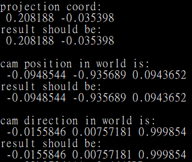
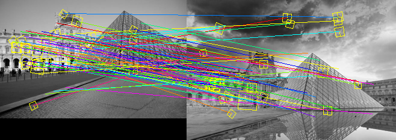
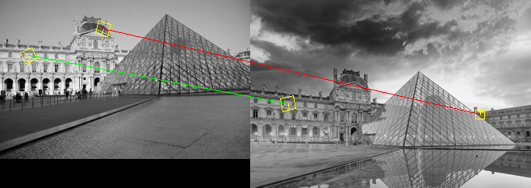
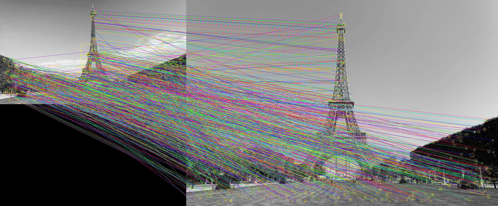
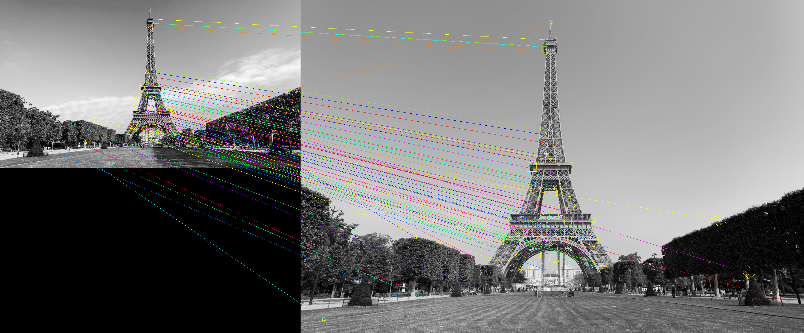
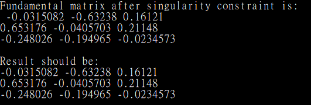
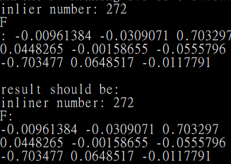
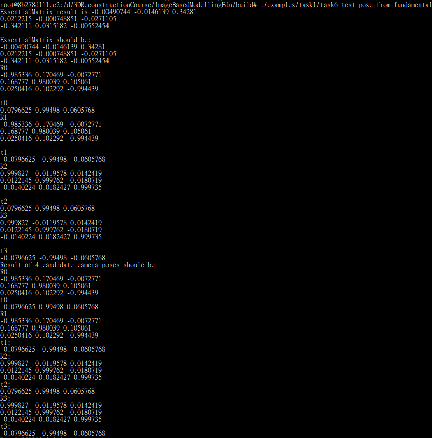
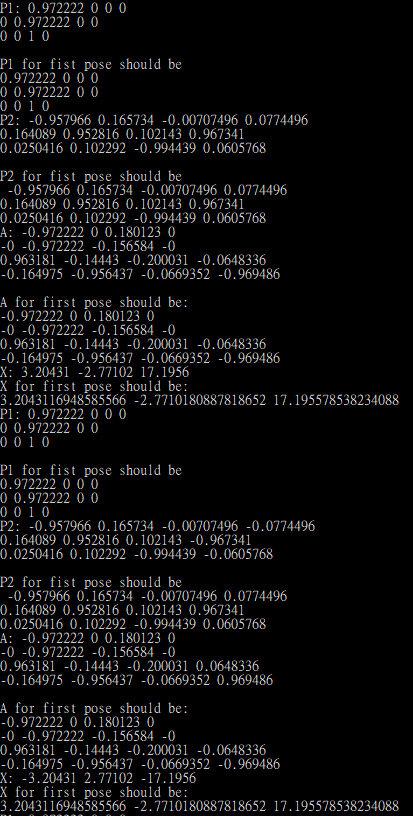
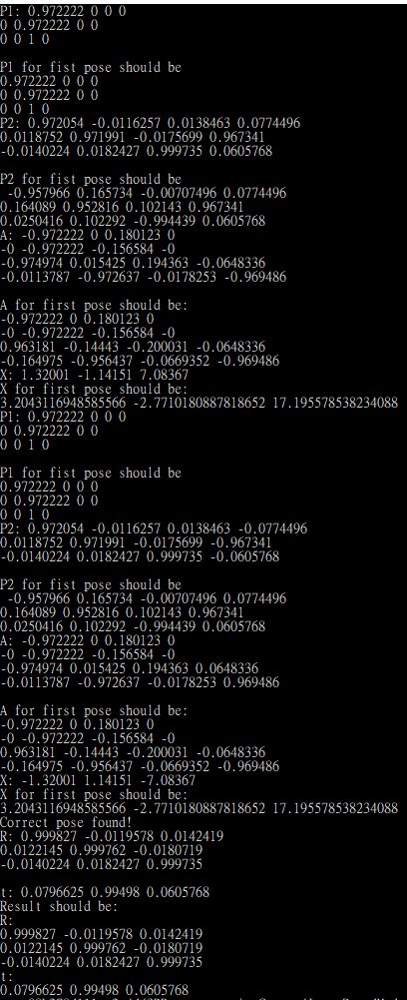

# HW1

## 代码编译

我的环境是Ubuntu 20.04的docker，为了运行[ImageBasedModellingEdu](https://github.com/weisui-ad/ImageBasedModellingEdu)，需做以下准备工作。

安装必要的包：

```sh
apt-get update -y
apt-get install -y git cmake vim build-essential wget
apt-get install -y libjpeg-dev libtiff-dev libpng-dev
```

并手动安装`eigen-3.3.9`。

修改代码：

- examples/task1/task5_test_fundamental_ransac.cc

  - 加上：
    
    ```cpp
    #include <cassert>
    ```

- texturing/global_seam_leveling.cpp

  - ```cpp
    assert(!isnan(difference[0]) && !isnan(difference[1]) && !isnan(difference[2]));
    ```

    在以上这一句的`isnan`之前都加上`std::`。

## Task 1-2

我用了`math::Matrix`，所以需要引用`math/matrix.h`：

```cpp
#include "math/matrix.h"
```

在`projection`函数中：

用矩阵乘法及加法计算出`p3d`在世界坐标系里的坐标`p3d_cam`。

```cpp
/*
world coordinate system to camera coordinate system
*/

//convert double[9] to math::Matrix<double, 3, 3>
math::Matrix<double, 3, 3> mat_R_(R_);
//convert double[3] to math::Vector<double, 3>
math::Vec3d vec_t_(t_);

math::Vec3d p3d_cam = mat_R_ * p3d + vec_t_;
```

将x,y坐标同除以z坐标，得到归一化像平面上的坐标：

```cpp
p[0] = p3d_cam[0]; p[1] = p3d_cam[1];
double z_cam = p3d_cam[2];

/*
convert to normalized image plane
*/
p[0] /= z_cam;
p[1] /= z_cam;
```

在归一化像平面上进行径向畸变：

```cpp
/*
radial distortion
*/
double r_sq = pow(p[0], 2) + pow(p[1], 2);
p[0] *= (1 + dist_[0]*r_sq + dist_[1]*pow(r_sq,2));
p[1] *= (1 + dist_[0]*r_sq + dist_[1]*pow(r_sq,2));
```

归一化像平面到物理像平面：

```cpp
/*
normalized image plane to physical image plane
*/
p[0] = f_ * p[0] + c_[0];
p[1] = f_ * p[1] + c_[1];
```

相机在世界坐标系中的位置：

```cpp
math::Vec3d pos_in_world(){

    math::Vec3d pos;
    pos[0] = R_[0]* t_[0] + R_[3]* t_[1] + R_[6]* t_[2];
    pos[1] = R_[1]* t_[0] + R_[4]* t_[1] + R_[7]* t_[2];
    pos[2] = R_[2]* t_[0] + R_[5]* t_[1] + R_[8]* t_[2];
    return -pos;
}
```

相机在世界坐标系的方向：

```cpp
math::Vec3d dir_in_world(){

    math::Vec3d  dir (R_[6], R_[7],R_[8]);
    return dir;
}
```



## Task 1-3

`matching.h`里：

lowe-ratio利用最近邻与次近邻比进行筛选：

```cpp
if (static_cast<float>(nn_result.dist_1st_best)
    / static_cast<float>(nn_result.dist_2nd_best)
    > MATH_POW2(options.lowe_ratio_threshold))
    continue;
```

下面是两个例子，第一行是原图，第二行是筛选前，第三行是筛选后：

<p float="left" align="center">
  
  
</p>





<p float="left" align="center">
  
  
</p>





## Task 1-4

直接线性变换法（8点法）推导（基于task4_test_fundamental_8_point.cc）：

双目视觉中相机之间存在对极约束$p_2^TFp_1=0$，其中$p_1$,$p_2$为来自两个视角的匹配对的归一化坐标，并表示成齐次坐标形式，即$p_1=[x_1, y_1, 1]^T, p_2=[x_2, y_2, 1]$。

将$p_1$,$p_2$的表达形式带入到上式中，可以得到如下表达形式：

$$ \begin{bmatrix}x_2 & y_2 & 1\end{bmatrix} * \begin{bmatrix}
f_{11} & f_{12} & f_{13} \\
f_{21} & f_{22} & f_{23} \\
f_{31} & f_{32} & f_{33}
\end{bmatrix} * \begin{bmatrix}
x_1 \\
y_1 \\
1
\end{bmatrix}$$

进一步可以得到：

$$x_1x_2f_{11} + x_2y_1f_{12} + x_2f_{13} + x_1y_2f_{21} + y_1y_2f_22 + y_2f_{23} + x_1f_{31} + y_1f_{32} + f_{33}=0$$

写成向量形式：

$$\begin{matrix}[x_1x_2 & x_2y_1 & x_2 & x_1y_2 & y_1y_2 & y_2 & x_1 & y_1 & 1]\end{matrix}*f = 0$$

其中$f=\begin{bmatrix}f_{11} & f_{12} & f_{13} & f_{21} & f_{22} & f_{23} & f_{31} & f_{32} & f_{33}\end{bmatrix}^T$

限制$f$的2-norm为1，因此$f$的自由度为9-1=8，所以至少需要8对匹配对才能求的$f$的解。当刚好有8对点时，称为8点法。当匹配对大于8时需要用最小二乘法进行求解：

$$A = \begin{bmatrix}
x_{11}x_{12} & x_{12}y_{11} & x_{12} &x_{11}y_{12} & y_{11}y_{12} & y_{12} & x_{11} & y_{11} & 1 \\ x_{21}x_{22} & x_{22}y_{21} & x_{22} &x_{21}y_{22} & y_{21}y_{22} & y_{22} & x_{21} & y_{21} & 1 \\ x_{31}x_{32} & x_{32}y_{31} & x_{32} &x_{31}y_{32} & y_{31}y_{32} & y_{32} & x_{31} & y_{31} & 1 \\ x_{41}x_{42} & x_{42}y_{41} & x_{42} &x_{41}y_{42} & y_{41}y_{42} & y_{42} & x_{41} & y_{41} & 1 \\ x_{51}x_{52} & x_{52}y_{51} & x_{52} &x_{51}y_{52} & y_{51}y_{52} & y_{52} & x_{51} & y_{51} & 1 \\ x_{61}x_{62} & x_{62}y_{61} & x_{62} &x_{61}y_{62} & y_{61}y_{62} & y_{62} & x_{61} & y_{61} & 1  \\ x_{71}x_{72} & x_{72}y_{71} & x_{72} &x_{71}y_{72} & y_{71}y_{72} & y_{72} & x_{71} & y_{71} & 1 \\ x_{81}x_{82} & x_{82}y_{81} & x_{82} &x_{81}y_{82} & y_{81}y_{82} & y_{82} & x_{81} & y_{81} & 1 \end{bmatrix}$$

现在任务变成了求解线性方程：$Af = 0$。通常的解法是对A进行SVD分解，取最小奇异值对应的奇异向量作为f的解，证明如下（参考自[Least–squares Solution of Homogeneous Equations](http://cmp.felk.cvut.cz/cmp/courses/XE33PVR/WS20072008/Lectures/Supporting/constrained_lsq.pdf)）：

我们的目标为：$min||Af|| s.t. ||f|| = 1$

将A透过SVD分解得到$A = U\Sigma V^T$。

$||Af|| \\ = ||U \Sigma V^Tf|| \\ = ||\Sigma V^T f||(U是旋转矩阵，不改变norm) \\ = ||\Sigma g||(令g = V^Tf)$

因为$\Sigma$是一个对角矩阵，并且奇异值由大到小排列，所以我们知道，将$g$设为$[0,0,...0,1]^T$时$\Sigma$对$g$所造成的缩放程度最小。

接下来是由$g$导出$f$，即$f = Vg = V[0,0,...0,1]^T$，也就是$V$的最后一个column。

得到$f$后，将它reshape成3*3即可得到F，但是目前它的秩为3，不符合基础矩阵秩为2的条件（F的定义域为2维空间，对应域为1为空间，所以它的秩为2）。

因此需要将F的一个奇异值设为0。步骤如下：

对F进行奇异值分解$F = USV^T$，得到对角矩阵$S=diag[\sigma_1, \sigma_2, \sigma_3]$，然后将$\sigma3$设置为0：

$S' = \begin{bmatrix}
\sigma_1 &       0 & 0 \\
0       & \sigma_2 & 0 \\
0       & 0       & 0
\end{bmatrix}$

，并重构$F = US'V^T $。

在`task4_test_fundamental_8_point.cc`的`fundamental_8_point`中：

```cpp
//build matrix A
math::Matrix<double, 8, 9> A;

for(int i = 0; i < 8; ++i){
    A(i, 0) = points1(0, i) * points2(0, i);
    A(i, 1) = points1(1, i) * points2(0, i);
    A(i, 2) = points1(2, i) * points2(0, i);
    A(i, 3) = points1(0, i) * points2(1, i);
    A(i, 4) = points1(1, i) * points2(1, i);
    A(i, 5) = points1(2, i) * points2(1, i);
    A(i, 6) = points1(0, i) * points2(2, i);
    A(i, 7) = points1(1, i) * points2(2, i);
    A(i, 8) = points1(2, i) * points2(2, i);
}

//SVD
math::Matrix<double, 9, 9> V;
math::matrix_svd<double, 8, 9>(A, nullptr, nullptr, &V);
math::Vector<double, 9> f = V.col(8);

//rebuild F(row-major)
for(int i = 0; i < 3; ++i){
    for(int j = 0; j < 3; ++j){
        F(i, j) = f(i*3 + j);
    }
}

math::Matrix<double, 3, 3> FU, FS, FV;
math::matrix_svd<double, 3, 3>(F, &FU, &FS, &FV);
FS(2, 2) = 0;
F = FU * FS * FV.transpose();
```



## Task 1-5

`task5_test_fundamental_ransac.cc`中：

迭代次数为$M = \frac{log(1-z)}{log(1-p^K)}$。

```cpp
int  calc_ransac_iterations (double p,
                           int K,
                           double z = 0.99){
    int M = static_cast<int>(log(1-z)/log(1-pow(p, K)));
    return M;
}
```

寻找inliers：只要距离小于设定好的阈值，就判定为inlier。

```cpp
std::vector<int> find_inliers(sfm::Correspondences2D2D const & matches
    ,FundamentalMatrix const & F, const double & thresh){
    const double squared_thresh = thresh* thresh;

    std::vector<int> inliers;

    for (std::size_t i = 0; i < matches.size(); ++i){
        sfm::Correspondence2D2D const& match = matches[i];
        double dist = calc_sampson_distance(F, match);
        // if(dist < thresh){
        if(dist < squared_thresh){
            inliers.push_back(i);
        }
    }

    return inliers;
}
```



## Task 1-6

求解本征矩阵：

```cpp
E = K2.transpose() * F * K1;
```

分解本征矩阵，得到4组旋转和平移向量：

$R_1 = UR_z(\pi/2)V^T$，其中$R_z(\pi/2) = \begin{bmatrix}cos(\pi/2) & -sin(\pi/2) & 0 \\ sin(\pi/2) & cos(\pi/2) & 0 \\ 0 & 0 & 1 \end{bmatrix} = \begin{bmatrix}0 & -1 & 0 \\ 1 & 0 & 0 \\ 0 & 0 & 1 \end{bmatrix}$

$R_2 = UR^T_z(\pi/2)V^T$，其中$R_z^T(\pi/2) = \begin{bmatrix}cos(-\pi/2) & -sin(-\pi/2) & 0 \\ sin(-\pi/2) & cos(-\pi/2) & 0 \\ 0 & 0 & 1 \end{bmatrix} = \begin{bmatrix}0 & 1 & 0 \\ -1 & 0 & 0 \\ 0 & 0 & 1 \end{bmatrix}$

$t_1 = U(:, 2)$

$t_2 = -U(:,2)$

4组旋转和平移向量为$(R_1, t_1), (R_1, t_2), (R_2, t_1), (R_2, t_2)$。

```cpp
math::Matrix<double, 3, 3> W(0.0);
W(0, 1) = -1.0; W(1, 0) = 1.0; W(2, 2) = 1.0;
math::Matrix<double, 3, 3> Wt(0.0);
Wt(0, 1) = 1.0; Wt(1, 0) = -1.0; Wt(2, 2) = 1.0;

math::Matrix<double, 3, 3> U, S, V;
math::matrix_svd(E, &U, &S, &V);

// 保证旋转矩阵 det(R) = 1 (instead of -1).
if (math::matrix_determinant(U) < 0.0)
    for (int i = 0; i < 3; ++i)
        U(i,2) = -U(i,2);
if (math::matrix_determinant(V) < 0.0)
    for (int i = 0; i < 3; ++i)
        V(i,2) = -V(i,2);


/* 相机的姿态一共有4中情况*/
V.transpose();
std::vector<std::pair<math::Matrix3d, math::Vec3d> > poses(4);
poses[0].first = U * W * V;
poses[1].first = U * W * V;
poses[2].first = U * Wt * V;
poses[3].first = U * Wt * V;
poses[0].second = U.col(2);
poses[1].second = -U.col(2);
poses[2].second = U.col(2);
poses[3].second = -U.col(2);

for(int i = 0; i < 4; ++i){
    std::cout << "R" << i << std::endl;
    std::cout << poses[i].first << std::endl;
    std::cout << "t" << i << std::endl;
    std::cout << poses[i].second << std::endl;
}
```

从 4 组 poses 中得到准确的 pose：

如果点P同时位于两相机的前方（z坐标大于0），则判断为正确的相机姿态。

```cpp
// 第一个相机的旋转矩阵R1设置为单位矩阵，平移向量t1设置为0
math::Matrix3d R1;
math::matrix_set_identity(&R1);
math::Vec3d t1;
t1.fill(0.0);

// 判断姿态是否合理
bool flags[4];
for(int i=0; i<4; i++){
    flags[i] = is_correct_pose(R1, t1, poses[i].first, poses[i].second);
}
//找到正确的姿态
if(flags[0]||flags[1]||flags[2]||flags[3]){
    for(int i=0; i<4; i++) {
        if(!flags[i])continue;
        R = poses[i].first;
        t =  poses[i].second;
    }
    return true;
}
return false;
```

`is_correct_pose`函数：

```cpp
bool  is_correct_pose (math::Matrix3d const &R1, math::Vec3d const & t1
                   ,math::Matrix3d const &R2, math::Vec3d const & t2) {

    /* 相机内参矩阵 */
    math::Matrix3d K1(0.0), K2(0.0);
    K1(0, 0) = K1(1, 1) = f1;
    K2(0, 0) = K2(1, 1) = f2;
    K1(2,2) = 1.0;
    K2(2,2) = 1.0;

    math::Vec3d p3d = triangulation(p1, p2, K1, R1, t1, K2, R2, t2);
    math::Vector<double, 3> x1 = R1 * p3d + t1;
    math::Vector<double, 3> x2 = R2 * p3d + t2;
    return x1[2] > 0.0f && x2[2] > 0.0f;
}
```








