# HW2

## 代码编译

`examples/task2/CMakeLists.txt`:

```
#set(TRIANGLE_FILE
#        task2-1_test_triangle.cc task2-2_test_p3p_ransac.cc)
set(TRIANGLE_FILE
        task2-1_test_triangle.cc)
```

`examples/task2/task2-3_test_lm_optimize.cc`:

```cpp
#include <cassert>
```

`examples/task2/task2-5_test_bundle_adjustment.cc`:

```cpp
#include <cassert>
```

`texturing/global_seam_leveling.cpp`:

```cpp
//assert(!isnan(difference[0]) && !isnan(difference[1]) && !isnan(difference[2]));
assert(!std::isnan(difference[0]) && !std::isnan(difference[1]) && !std::isnan(difference[2]));
```

## Task 2-1

作业文档里有两个Task 2-1，这是第一个Task 2-1。

`examples/task2/task2-1_test_triangle.cc`

```cpp
std::vector<math::Vec2f> points = {p1, p2};
std::vector<math::Matrix<double, 3, 4>> Projs = {P1, P2};
for(int i = 0; i < 2; ++i){
    //xiPi3 - Pi1
    //A.row() is not returning its reference, so this is invalid!!
    //A.row(i*2) = Projs[i].row(2) * static_cast<double>(points[i](0)) - Projs[i].row(0);
    math::Vec4d r1 = Projs[i].row(2) * static_cast<double>(points[i](0)) - Projs[i].row(0);
    for(int j = 0; j < 4; ++j) A(i*2, j) = r1(j);

    //yiPi3 - Pi2
    // A.row(i*2+1) = Projs[i].row(2) * static_cast<double>(points[i](1)) - Projs[i].row(1);
    math::Vec4d r2 = Projs[i].row(2) * static_cast<double>(points[i](1)) - Projs[i].row(1);
    for(int j = 0; j < 4; ++j) A(i*2+1, j) = r2(j);
}
```

运行结果截图：

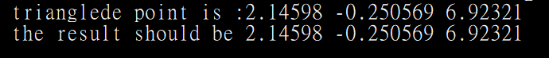

## Task 2-2

p3p_kneip运行结果截图：

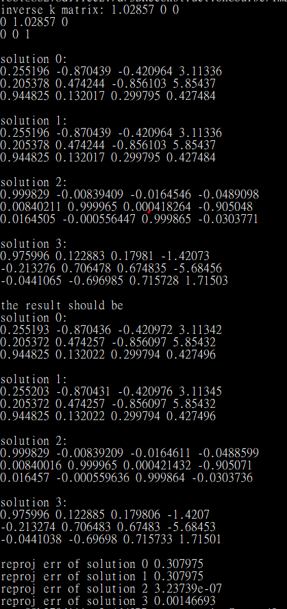

p3p_ransac运行结果截图：

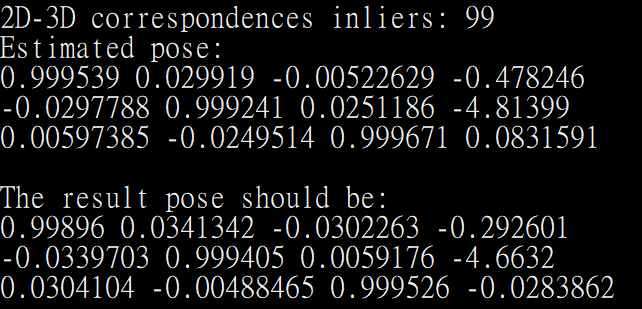

## Task 2-3

`lm_optimization`的Pseudocode：

有些函数会直接对输入做修改，这里为了方便理解，将它们改成"输出=函数(输入)"的形式。

```cpp
/**
 * /description  LM 算法流程
 * @param cameras
 * @param points
 * @param observations
 */
FUNCTION lm_optimization(两个相机的内外参, 多个点坐标, 记录相机跟三维点的匹配的数据结构)
    /*1.0 初始化*/
    // 计算重投影误差向量
    INIT 误差向量, 新误差向量
    SET 误差向量 to 计算重投影误差向量(两个相机的内外参, 多个点坐标, 记录相机跟三维点的匹配的数据结构)// todo F 是误差向量
    // 计算初始的均方误差
    SET 当前mse to 计算mse(误差向量)
    SET 初始mse to 当前mse
    SET 最终mse to 当前mse

    // 设置共轭梯度法的相关参数
    SET 信赖域半径 to 信赖域半径初始常数

    /* Levenberg-Marquard 算法. */
    FOR LM算法迭代次数
        // 判断终止条件，均方误差小于一定阈值
        IF 当前mse < LM算法mse阈值 THEN
            PRINT "BA: Satisfied MSE threshold."
            跳出FOR循环
        ENDIF

        //1.0 计算雅阁比矩阵
        INIT 相机Jacobian, 三维点Jacobian
   	    // 原函数不是这种形式，但这里为了方便理解，改成"输出=函数(输入)"的形式
        SET 相机Jacobian, 三维点Jacobian to 计算Jacobian(两个相机的内外参, 多个点坐标, 记录相机跟三维点的匹配的数据结构)

        //2.0 预置共轭梯梯度法对正规方程进行求解*/
        INIT 用于更新的向量
        SET 共轭梯度法求解状态, 用于更新的向量 to 共轭梯度法求解(相机Jacobian, 三维点Jacobian, 误差向量)

        //3.0 根据计算得到的偏移量，重新计算重投影误差和均方误差，用于判断终止条件和更新条件.
        INIT 新mse, mse变化量, mse变化幅度
        SET mse变化幅度 to 1.0

        // 正规方程求解成功的情况下
        IF 共轭梯度法求解状态 为 成功 THEN
            /*重新计算相机和三维点，计算重投影误差，注意原始的相机参数没有被更新*/
            SET 新误差向量 to 计算重投影误差向量(用于更新的向量, 两个相机的内外参, 多个点坐标, 记录相机跟三维点的匹配的数据结构)
            /* 计算新的残差值 */
            SET 新mse to 计算mse(新误差向量)
            /* 均方误差的绝对变化值和相对变化率*/
            SET mse变化量 to 当前mse - 新mse
            SET mse变化幅度 to 1.0 - 新mse / 当前mse
        // 正规方程求解失败的情况下
        ELSE
            SET 新mse to 当前mse
            SET mse变化量 to 0.0
        ENDIF

        // 注意delta_mse是current_mse - new_mse
        // new_mse < current_mse表示残差值减少
        INIT 迭代成功与否
        SET 迭代成功与否 to mse变化量是否大于0.0

        /*
         * 如果正规方程求解成功，则更新相机参数和三维点坐标，并且增大信赖域的尺寸，使得求解方式
         * 趋近于高斯牛顿法
         */
        IF 迭代成功与 为 成功 THEN
            PRINT "BA: #", LM算法迭代次数, " success", ", MSE ", 当前mse, " -> ", 新mse, ", CG ", 共轭梯度法求解状态.共轭梯度法迭代次数, ", TRR ", 信赖域半径, ", MSE Ratio: ", mse变化幅度

            SET LM算法迭代次数 to LM算法迭代次数 + 1
            SET LM算法成功迭代次数 to LM算法成功迭代次数 + 1

            /* 对相机参数和三点坐标进行更新 */
            更新参数(用于更新的向量, 两个相机的内外参, 多个点坐标)

            交换(误差向量, 新误差向量)
            SET 当前mse to 新mse

            IF mse变化幅度 小于 LM算法mse变化幅度阈值 THEN
                PRINT "BA: Satisfied delta mse ratio threshold of ", LM算法mse变化幅度阈值
                跳出FOR循环
            ENDIF

            // 增大信赖域大小
            SET 信赖域半径 to 信赖域半径 * 信赖域半径放大倍数
        ELSE
            PRINT "BA: #", LM算法迭代次数, " failure", ", MSE ", 当前mse, ",    ", ", CG ", 共轭梯度法求解状态.共轭梯度法迭代次数, ", TRR ", 信赖域半径

            SET LM算法迭代次数 to LM算法迭代次数 + 1
            SET LM算法失败迭代次数 to LM算法失败迭代次数 + 1
            // 求解失败的减小信赖域尺寸
            SET 信赖域半径 to 信赖域半径 * 信赖域半径缩小倍数
        ENDIF

        /* 判断是否超过最大的迭代次数. */
        IF LM算法迭代次数 + 1 大于等于 LM算法最大迭代次数 THEN
            PRINT "BA: Reached maximum LM iterations of ", LM算法最大迭代次数
            跳出FOR循环
        ENDIF
    END LOOP

    SET 最终mse to 当前mse
END FUNCTION
```

运行结果截图：

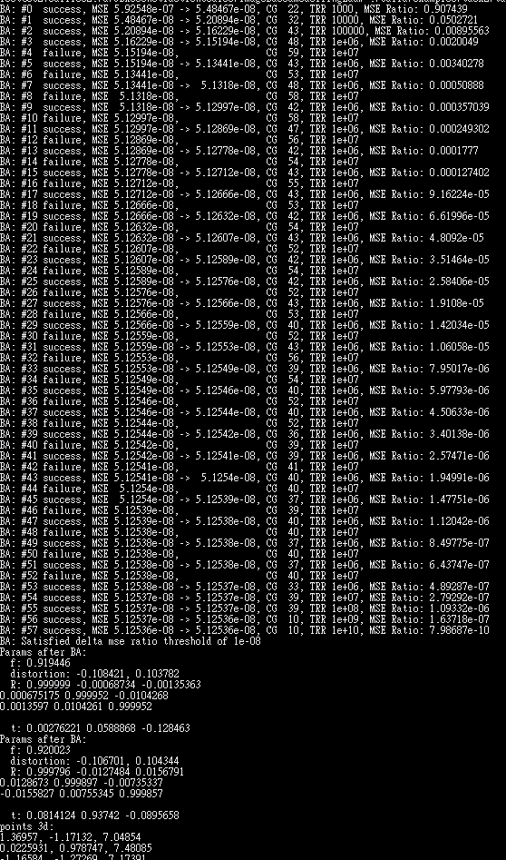

## Task 2-4

作业文档里有两个Task 2-1，这是第二个Task 2-1，也是Task 2-4。

`task2-4_test_jacobian.cc`

```cpp
#include "math/vector.h"
#include "math/matrix.h"

void jacobian(sfm::ba::Camera const& cam,
              sfm::ba::Point3D const& point,
              double* cam_x_ptr, double* cam_y_ptr,
              double* point_x_ptr, double* point_y_ptr)
{
    const double f = cam.focal_length;
    const double *R = cam.rotation;
    const double *t = cam.translation;
    const double *X = point.pos;
    const double k0 = cam.distortion[0];
    const double k1 = cam.distortion[1];

    math::Matrix<double, 3, 3> R_mat(R);
    math::Vec3d t_vec(t);
    math::Vec3d X_vec(X);
    math::Vec3d Xc_vec = R_mat * X_vec + t_vec; //3d point in camera coordinate
    math::Vec2d X_norm(Xc_vec[0]/Xc_vec[2], Xc_vec[1]/Xc_vec[2]); //in normalized image plane
    const double r_sq = X_norm[0]*X_norm[0] + X_norm[1]*X_norm[1];
    const double D = 1 + k0 * r_sq + k1 * r_sq * r_sq;

    // 相机焦距的偏导数
    // du/df = D(x,y) * x
    cam_x_ptr[0] = D * X_norm[0];
    // dv/df = D(x,y) * y
    cam_y_ptr[0] = D * X_norm[1];

    // 相机径向畸变的偏导数
    // du/dk0 = f * x * r^2
    cam_x_ptr[1] = f * X_norm[0] * r_sq;
    // du/dk1 = f * x * r^4
    cam_x_ptr[2] = f * X_norm[0] * r_sq * r_sq;
    // dv/dk0 = f * y * r^2
    cam_y_ptr[1] = f * X_norm[1] * r_sq;
    // dv/dk1 = f * y * r^4
    cam_y_ptr[2] = f * X_norm[1] * r_sq * r_sq;

    // 相机将向畸变系数的偏导数 //duplicate!!
    // cam_x_ptr[1] = 0.0;
    // cam_x_ptr[2] = 0.0;
    // cam_y_ptr[1] = 0.0;
    // cam_y_ptr[2] = 0.0;

    // du/dD = f * x
    const double dudD = f * X_norm[0];
    // dv/dD = f * y
    const double dvdD = f * X_norm[1];
    // du/dx = fD
    const double dudx = f * D;
    // dv/dy = fD
    const double dvdy = f * D;
    // dD/dxc = (k0 + 2*k1*r^2)*2*x/zc
    const double dDdxc = (k0 + 2*k1*r_sq)*2*X_norm[0]/Xc_vec[2];
    // dD/dyc = (k0 + 2*k1*r^2)*2*y/zc
    const double dDdyc = (k0 + 2*k1*r_sq)*2*X_norm[1]/Xc_vec[2];
    // dD/dzc = -(k0 + 2*k1*r^2)*2*r^2/zc
    const double dDdzc = -(k0 + 2*k1*r_sq)*2*r_sq/Xc_vec[2];
    // dx/dxc = 1/zc
    const double dxdxc = 1/Xc_vec[2];
    // dx/dyc = 0
    const double dxdyc = 0;
    // dx/dzc = -x/zc
    const double dxdzc = -X_norm[0]/Xc_vec[2];
    // dy/dxc = 0
    const double dydxc = 0;
    // dy/dyc = 1/zc
    const double dydyc = 1/Xc_vec[2];
    // dy/dzc = -y/zc
    const double dydzc = -X_norm[1]/Xc_vec[2];

    // 相机平移向量的偏导数
    // du/dt0 = du/dxc = du/dD * dD/dxc + du/dx * dx/dxc
    cam_x_ptr[3] = dudD * dDdxc + dudx * dxdxc;
    // du/dt1 = du/dyc = du/dD * dD/dyc + du/dx * dx/dyc
    cam_x_ptr[4] = dudD * dDdyc + dudx * dxdyc;
    // du/dt2 = du/dzc = du/dD * dD/dzc + du/dx * dx/dzc
    cam_x_ptr[5] = dudD * dDdzc + dudx * dxdzc;
    // dv/dt0 = dv/dxc = dv/dD * dD/dxc + dv/dy * dy/dxc
    cam_y_ptr[3] = dvdD * dDdxc + dvdy * dydxc;
    // dv/dt1 = dv/dyc = dv/dD * dD/dyc + dv/dy * dy/dyc
    cam_y_ptr[4] = dvdD * dDdyc + dvdy * dydyc;
    // dv/dt2 = dv/dzc = dv/dD * dD/dzc + dv/dy * dy/dzc
    cam_y_ptr[5] = dvdD * dDdzc + dvdy * dydzc;

    // dxc/dw0 = 0
    const double dxcdw0 = 0;
    // dxc/dw1 = r2 * X
    const double dxcdw1 = R_mat.row(2).dot(X_vec);
    // dxc/dw2 = -r1 * X
    const double dxcdw2 = -R_mat.row(1).dot(X_vec);
    // dyc/dw0 = -r2 * X
    const double dycdw0 = -R_mat.row(2).dot(X_vec);
    // dyc/dw1 = 0
    const double dycdw1 = 0;
    // dyc/dw2 = r0 * X
    const double dycdw2 = R_mat.row(0).dot(X_vec);
    // dzc/dw0 = r1 * X
    const double dzcdw0 = R_mat.row(1).dot(X_vec);
    // dzc/dw1 = -r0 * X
    const double dzcdw1 = -R_mat.row(0).dot(X_vec);
    // dzc/dw2 = 0
    const double dzcdw2 = 0;

    // 相机旋转矩阵的偏导数
    // du/dw0 = du/dyc * dyc/dw0 + du/dzc * dzc/dw0
    cam_x_ptr[6] = cam_x_ptr[4] * dycdw0 + cam_x_ptr[5] * dzcdw0;
    // du/dw1 = du/dxc * dxc/dw1 + du/dzc * dzc/dw1
    cam_x_ptr[7] = cam_x_ptr[3] * dxcdw1 + cam_x_ptr[5] * dzcdw1;
    // du/dw2 = du/dxc * dxc/dw2 + du/dyc * dyc/dw2
    cam_x_ptr[8] = cam_x_ptr[3] * dxcdw2 + cam_x_ptr[4] * dycdw2;
    // dv/dw0 = dv/dyc * dyc/dw0 + dv/dzc * dzc/dw0
    cam_y_ptr[6] = cam_y_ptr[4] * dycdw0 + cam_y_ptr[5] * dzcdw0;
    // dv/dw1 = dv/dxc * dxc/dw1 + dv/dzc * dzc/dw1
    cam_y_ptr[7] = cam_y_ptr[3] * dxcdw1 + cam_y_ptr[5] * dzcdw1;
    // dv/dw2 = dv/dxc * dxc/dw2 + dv/dyc * dyc/dw2
    cam_y_ptr[8] = cam_y_ptr[3] * dxcdw2 + cam_y_ptr[4] * dycdw2;

    // 三维点的偏导数
    // du/dxw = du/dxc * dxc/dxw + du/dyc * dyc/dxw + du/dzc * dzc/dxw
    point_x_ptr[0] = cam_x_ptr[3] * R_mat(0,0) + cam_x_ptr[4] * R_mat(1,0) + cam_x_ptr[5] * R_mat(2,0);
    // du/dyw = du/dxc * dxc/dyw + du/dyc * dyc/dyw + du/dzc * dzc/dyw
    point_x_ptr[1] = cam_x_ptr[3] * R_mat(0,1) + cam_x_ptr[4] * R_mat(1,1) + cam_x_ptr[5] * R_mat(2,1);
    // du/dzw = du/dxc * dxc/dzw + du/dyc * dyc/dzw + du/dzc * dzc/dzw
    point_x_ptr[2] = cam_x_ptr[3] * R_mat(0,2) + cam_x_ptr[4] * R_mat(1,2) + cam_x_ptr[5] * R_mat(2,2);
    // dv/dxw = dv/dxc * dxc/dxw + dv/dyc * dyc/dxw + dv/dzc * dzc/dxw
    point_y_ptr[0] = cam_y_ptr[3] * R_mat(0,0) + cam_y_ptr[4] * R_mat(1,0) + cam_y_ptr[5] * R_mat(2,0);
    // dv/dyw = dv/dxc * dxc/dyw + dv/dyc * dyc/dyw + dv/dzc * dzc/dyw
    point_y_ptr[1] = cam_y_ptr[3] * R_mat(0,1) + cam_y_ptr[4] * R_mat(1,1) + cam_y_ptr[5] * R_mat(2,1);
    // dv/dzw = dv/dxc * dxc/dzw + dv/dyc * dyc/dzw + dv/dzc * dzc/dzw
    point_y_ptr[2] = cam_y_ptr[3] * R_mat(0,2) + cam_y_ptr[4] * R_mat(1,2) + cam_y_ptr[5] * R_mat(2,2);
}
```

运行结果截图：

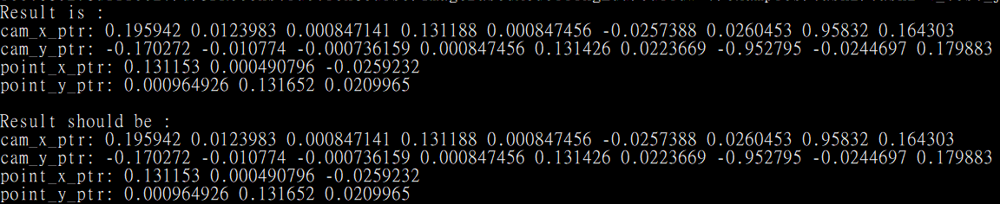

## Task 2-5

```sh
apt-get install libimage-exiftool-perl
exiftool IMG_0191.JPG
```

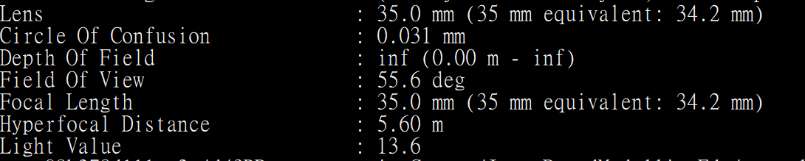

```
./examples/task2/task2-5_test_ba ../examples/data/sequence/IMG_0191.JPG ../examples/data/sequence/IMG_0192.JPG
```

运行结果截图：

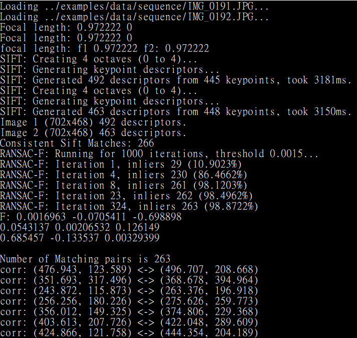

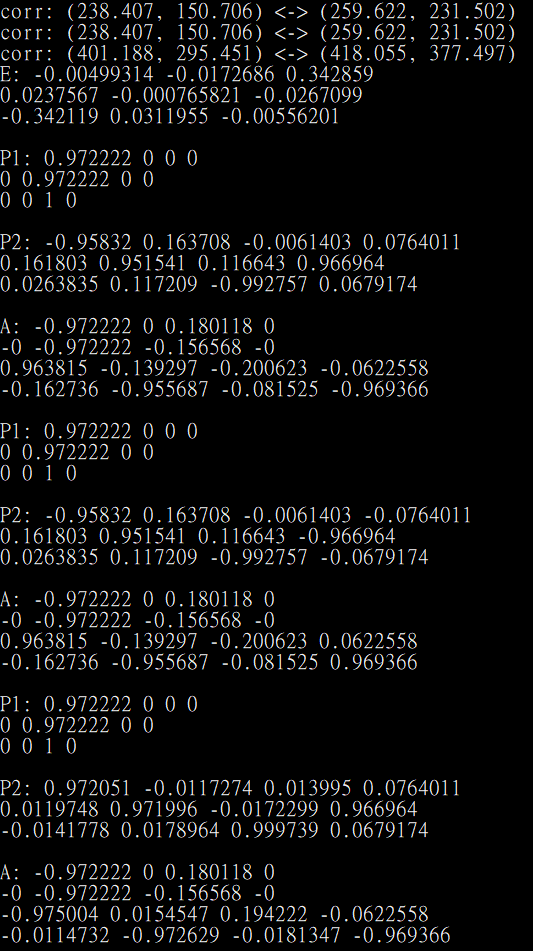

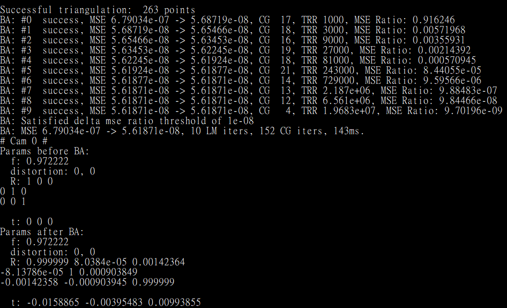

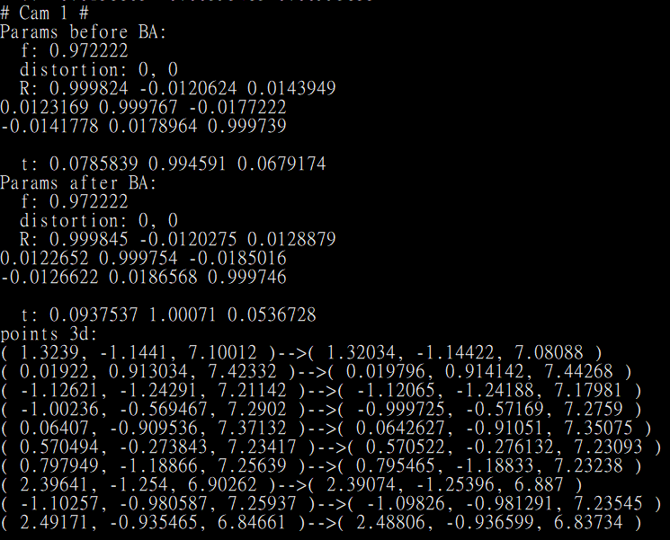

将两张输入图像的关键点可视化：

```cpp
core::ByteImage::Ptr img1_drawn(img1), img2_drawn(img2);
unsigned char color_rgb_red[3] = { 255, 0, 0 };
unsigned char color_rgb_blue[3] = { 0, 0, 255 };
float const f1width = static_cast<float>(feat1.width);
float const f1height = static_cast<float>(feat1.height);
float const f1norm = std::max(f1width, f1height);
float const f2width = static_cast<float>(feat2.width);
float const f2height = static_cast<float>(feat2.height);
float const f2norm = std::max(f2width, f2height);
for(sfm::Correspondence2D2D& corr : corrs){
    // denormalize image coordinates
    double p1u = corr.p1[0];
    double p1v = corr.p1[1];
    double p2u = corr.p2[0];
    double p2v = corr.p2[1];
    denormalize(f1norm, f1width, f1height, p1u, p1v);
    denormalize(f2norm, f2width, f2height, p2u, p2v);

    std::cout << "corr: (" << p1u << ", " << p1v <<
        ") <-> (" << p2u << ", " << p2v << ")" << std::endl;
    core::image::draw_circle<uint8_t>(*img1_drawn, p1u, p1v, 2, color_rgb_red);
    core::image::draw_circle<uint8_t>(*img2_drawn, p2u, p2v, 2, color_rgb_red);
}
core::image::save_file(img1_drawn, std::string("img1_drawn.jpg"));
core::image::save_file(img2_drawn, std::string("img2_drawn.jpg"));
```

当中用到的`denormalize`函数：

```cpp
void denormalize(const float& fnorm,
        const float& fwidth,
        const float& fheight,
        double& u,
        double& v){
    u = u * fnorm + fwidth / 2.0f - 0.5f;
    v = v * fnorm + fheight / 2.0f - 0.5f;
};
```

`IMG_0191.JPG`及`IMG_0192.JPG`的关键点：

<p float="left" align="center">
  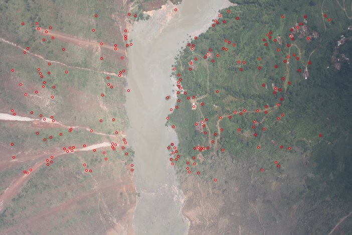
  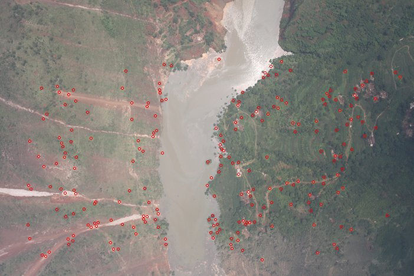
</p>

储存BA优化前后的三维点：

```cpp
std::ofstream fold_pts_3d("pts_3d.txt");
std::ofstream fnew_pts_3d("new_pts_3d.txt");
std::cout<<"points 3d: "<<std::endl;
for(int i=0; i<pts_3d.size(); i++) {
    std::cout<<"( "<<pts_3d[i][0]<<", "<<pts_3d[i][1]<<", "<<pts_3d[i][2]<<" )";
    std::cout<<"-->";
    std::cout<<"( "<<new_pts_3d[i][0]<<", "<<new_pts_3d[i][1]<<", "<<new_pts_3d[i][2]<<" )"<<std::endl;
    fold_pts_3d << pts_3d[i][0]<<" "<<pts_3d[i][1]<<" "<<pts_3d[i][2] << "\n";
    fnew_pts_3d << new_pts_3d[i][0]<<" "<<new_pts_3d[i][1]<<" "<<new_pts_3d[i][2] << "\n";
}
fold_pts_3d.close();
fnew_pts_3d.close();
```

红色为优化前，白色为优化后：

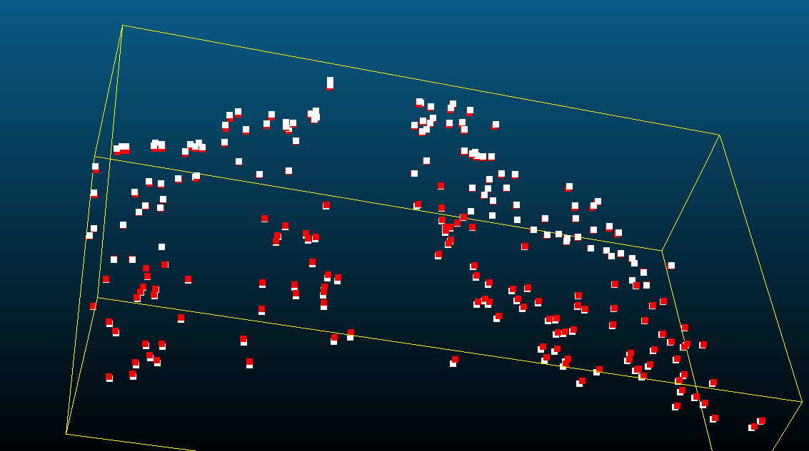

将三维点重投影到图像上，并与原来的点作比较：

```cpp
std::vector<double> rps;
reproject(rps, cams, p3ds, observations);

std::vector<core::ByteImage::Ptr> reprojected_imgs(2);
reprojected_imgs[0] = core::ByteImage::Ptr(img1);
reprojected_imgs[1] = core::ByteImage::Ptr(img2);
for(int i = 0; i < corrs_filtered.size(); ++i){
    // denormalize image coordinates
    double p1u = corrs_filtered[i].p1[0];
    double p1v = corrs_filtered[i].p1[1];
    double p2u = corrs_filtered[i].p2[0];
    double p2v = corrs_filtered[i].p2[1];
    denormalize(f1norm, f1width, f1height, p1u, p1v);
    denormalize(f2norm, f2width, f2height, p2u, p2v);

    // std::cout << "corr: (" << p1u << ", " << p1v <<
    //     ") <-> (" << p2u << ", " << p2v << ")" << std::endl;

    core::image::draw_circle<uint8_t>(*reprojected_imgs[0],
                                      p1u, p1v, 3, color_rgb_red);
    core::image::draw_circle<uint8_t>(*reprojected_imgs[1],
                                      p2u, p2v, 3, color_rgb_red);
    p1u = rps[i*4];
    p1v = rps[i*4+1];
    p2u = rps[i*4+2];
    p2v = rps[i*4+3];
    denormalize(f1norm, f1width, f1height, p1u, p1v);
    denormalize(f2norm, f2width, f2height, p2u, p2v);
    core::image::draw_circle<uint8_t>(*reprojected_imgs[0],
                                      p1u, p1v, 2, color_rgb_blue);
    core::image::draw_circle<uint8_t>(*reprojected_imgs[1],
                                      p2u, p2v, 2, color_rgb_blue);
}
core::image::save_file(reprojected_imgs[0], std::string("img1_reproject.jpg"));
core::image::save_file(reprojected_imgs[1], std::string("img2_reproject.jpg"));
```

当中用到的`reproject`函数及`radial_distort`函数：

```cpp
void radial_distort (double* x, double* y, double const* dist)
{
    double const radius2 = *x * *x + *y * *y;
    double const factor = 1.0 + radius2 * (dist[0] + dist[1] * radius2);
    *x *= factor;
    *y *= factor;
}

void reproject(std::vector<double>& rps
        , std::vector<sfm::ba::Camera>& cameras
        , std::vector<sfm::ba::Point3D>& points
        ,std::vector<sfm::ba::Observation>& observations){
    if (rps.size() != observations.size() * 2)
        rps.resize(observations.size() * 2);

    // reproject new_pts_3d to image and show
    #pragma omp parallel for
    for (std::size_t i = 0; i < observations.size(); ++i)
    {
        //二維平面上觀察到的點
        sfm::ba::Observation const& obs = observations.at(i);
        sfm::ba::Point3D const& p3d = points.at(obs.point_id);
        sfm::ba::Camera const& cam = cameras.at(obs.camera_id);

        //sfm::ba::Camera裡focal_length是double,其餘是double的array
        double const* flen = &cam.focal_length; // 相机焦距
        double const* dist = cam.distortion;    // 径向畸变系数
        double const* rot = cam.rotation;       // 相机旋转矩阵
        double const* trans = cam.translation;  // 相机平移向量
        double const* point = p3d.pos;          // 三维点坐标

        sfm::ba::Point3D new_point;
        sfm::ba::Camera new_camera;

        /* Project point onto image plane. */
        double rp[] = { 0.0, 0.0, 0.0 };
        for (int d = 0; d < 3; ++d)
        {
            rp[0] += rot[0 + d] * point[d];
            rp[1] += rot[3 + d] * point[d];
            rp[2] += rot[6 + d] * point[d];
        }
        rp[2] = (rp[2] + trans[2]);
        rp[0] = (rp[0] + trans[0]) / rp[2];
        rp[1] = (rp[1] + trans[1]) / rp[2];

        /* Distort reprojections. */
        radial_distort(rp + 0, rp + 1, dist);

        /* Compute reprojection error. */
        rps.at(i * 2 + 0) = rp[0] * (*flen);
        rps.at(i * 2 + 1) = rp[1] * (*flen);
    }
};
```

红色为原来的点，蓝色为重投影得到的点：

<p float="left" align="center">
  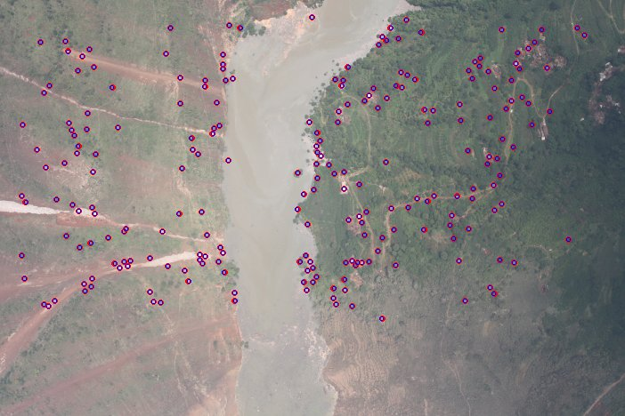
  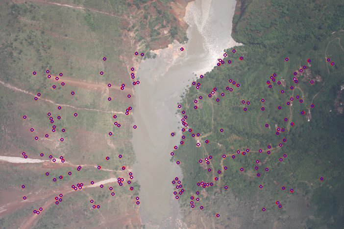
</p>


