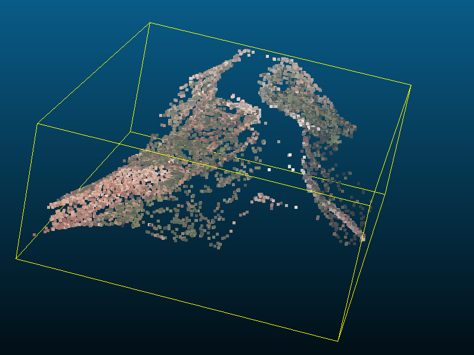

# HW3

## compile

- examples/task3/task3-1_test_incremental_sfm.cc

  ```cpp
  #include <cassert>
  ```

## 3-1

```sh
./examples/task3/task3-1_incremental_sfm ../examples/data/sequence ../../HW3/scene
```

运行结果：

```
Found 7 directory entries.
Importing image: IMG_0191.JPG, writing MVE view: view_0000.mve...
Importing image: IMG_0192.JPG, writing MVE view: view_0001.mve...
Importing image: IMG_0193.JPG, writing MVE view: view_0002.mve...
Importing image: IMG_0194.JPG, writing MVE view: view_0003.mve...
Importing image: IMG_0195.JPG, writing MVE view: view_0004.mve...
Importing image: IMG_0196.JPG, writing MVE view: view_0005.mve...
Importing image: IMG_0197.JPG, writing MVE view: view_0006.mve...
Imported 7 input images, took 23570 ms.
Scene has 7 views.
Computing image features...
View ID 0000 (2808x1872),  8219 features, took 58990 ms.
View ID 0001 (2808x1872),  8716 features, took 52996 ms.
View ID 0002 (2808x1872),  7370 features, took 56010 ms.
View ID 0003 (2808x1872),  7865 features, took 55453 ms.
View ID 0004 (2808x1872),  8264 features, took 53128 ms.
View ID 0005 (2808x1872),  8431 features, took 54138 ms.
View ID 0006 (2808x1872),  9477 features, took 53191 ms.
Computed 58342 features for 7 views (average 8334).
Computing features took 383913 ms.
Feature detection took 383913ms.
Performing feature matching...
Pair (1,0) matched, 3492 inliers, took 18475 ms.
Pair (2,0) matched, 1402 inliers, took 15853 ms.
Pair (2,1) matched, 3037 inliers, took 17316 ms.
Pair (3,0) matched, 700 inliers, took 18047 ms.
Pair (3,1) matched, 1501 inliers, took 17880 ms.
Pair (3,2) matched, 3175 inliers, took 15864 ms.
Pair (4,0) matched, 337 inliers, took 17278 ms.
Pair (4,1) matched, 700 inliers, took 18013 ms.
Pair (4,2) matched, 1603 inliers, took 15777 ms.
Pair (4,3) matched, 3729 inliers, took 16437 ms.
Pair (5,0) matched, 60 inliers, took 16964 ms.
Pair (5,1) matched, 192 inliers, took 18329 ms.
Pair (5,2) matched, 695 inliers, took 15452 ms.
Pair (5,3) matched, 1887 inliers, took 16576 ms.
Pair (5,4) matched, 3773 inliers, took 17304 ms.
Pair (6,0) rejected, matches below threshold of 24.
Pair (6,1) matched, 25 inliers, took 21286 ms.
Pair (6,2) matched, 315 inliers, took 18618 ms.
Pair (6,3) matched, 1001 inliers, took 18750 ms.
Pair (6,4) matched, 2025 inliers, took 19248 ms.
Pair (6,5) matched, 4055 inliers, took 19725 ms.
Found a total of 20 matching image pairs.
Matching took 371506 ms.
Feature matching took 371506ms.
Cleanup: Released 0 embeddings in 0 of 7 views.
Initializing camera intrinsics...
Computing feature tracks...
Propagating track IDs...
Removing tracks with conflicts... deleted 20 tracks.
Colorizing tracks...
Created a total of 12789 tracks.
Searching for initial pair...
P1: 0.972222 0 0 0
0 0.972222 0 0
0 0 1 0

P2: 0.972219 0.00180888 0.00158725 0.083626
-0.00177547 0.97201 -0.0202222 0.967557
-0.00167094 0.020797 0.999782 0.0466321

A: -0.972222 0 0.0544308 0
0 -0.972222 0.182625 0
-0.97233 -0.000427271 0.0648315 -0.0805281
0.00129853 -0.966074 0.305594 -0.954247

  Pair   5,  6: 4083 matches, 3190 H-inliers (78%),  8.17 pair angle
Using views 5 and 6 as initial pair.
Triangulated 4082 new tracks, rejected 1 bad tracks.
  Rejected 1 tracks with unstable angle.
  Splitted 0 new tracks.
Deleted 164 of 4082 tracks (4.02%) above a threshold of 0.000277371.
Running full bundle adjustment...
BA: #0  success, MSE 1.31806e-08 -> 4.19662e-09, CG  25, TRR 1000, MSE Ratio: 0.681607
BA: Satisfied MSE threshold.
BA: MSE 1.31806e-08 -> 4.19662e-09, 1 LM iters, 25 CG iters, 335ms.
Camera   5, focal length: 0.97222 -> 0.97270, distortion: -0.00917 0.02174
Camera   6, focal length: 0.97222 -> 0.97219, distortion: -0.01446 0.03815

Adding next view ID 4 (3 of 7)...
Collected 2113 2D-3D correspondences.
Selected 2113 2D-3D correspondences inliers (100%), took 1364ms.
Reconstructed camera 4 with focal length 0.972222
Running single camera bundle adjustment...
BA: #0  success, MSE 4.67378e-07 -> 2.00301e-07, CG  12, TRR 1000, MSE Ratio: 0.571436
BA: #1  success, MSE 2.00301e-07 -> 1.72183e-07, CG  12, TRR 3000, MSE Ratio: 0.140378
BA: #2  success, MSE 1.72183e-07 -> 1.70205e-07, CG  12, TRR 9000, MSE Ratio: 0.0114872
BA: #3  success, MSE 1.70205e-07 -> 1.70165e-07, CG  12, TRR 27000, MSE Ratio: 0.000238515
BA: #4  success, MSE 1.70165e-07 -> 1.70165e-07, CG  10, TRR 81000, MSE Ratio: 1.10173e-06
BA: Satisfied delta mse ratio threshold of 0.0001
BA: MSE 4.67378e-07 -> 1.70165e-07, 5 LM iters, 58 CG iters, 127ms.
Camera   4, focal length: 0.97222 -> 0.96454, distortion: -0.01970 0.05194
Triangulated 2009 new tracks, rejected 1 bad tracks.
  Rejected 1 tracks with unstable angle.
  Splitted 0 new tracks.
Running full bundle adjustment...
Deleted 913 of 5927 tracks (15.40%) above a threshold of 0.000485173.
BA: #0  success, MSE 3.95895e-08 -> 1.14503e-08, CG  30, TRR 1000, MSE Ratio: 0.710775
BA: #1  success, MSE 1.14503e-08 -> 1.03522e-08, CG  43, TRR 3000, MSE Ratio: 0.0959002
BA: #2  success, MSE 1.03522e-08 -> 9.68624e-09, CG  50, TRR 9000, MSE Ratio: 0.0643289
BA: Satisfied MSE threshold.
BA: MSE 3.95895e-08 -> 9.68624e-09, 3 LM iters, 123 CG iters, 1773ms.
Camera   4, focal length: 0.96454 -> 0.97147, distortion: -0.03062 0.07862
Camera   5, focal length: 0.97270 -> 0.97412, distortion: -0.02651 0.06386
Camera   6, focal length: 0.97219 -> 0.96770, distortion: -0.03106 0.06706

Adding next view ID 3 (4 of 7)...
Collected 1807 2D-3D correspondences.
Selected 1807 2D-3D correspondences inliers (100%), took 1164ms.
Reconstructed camera 3 with focal length 0.972222
Running single camera bundle adjustment...
BA: #0  success, MSE 1.52371e-07 -> 9.26779e-08, CG  12, TRR 1000, MSE Ratio: 0.39176
BA: #1  success, MSE 9.26779e-08 -> 8.95661e-08, CG  11, TRR 3000, MSE Ratio: 0.0335768
BA: #2  success, MSE 8.95661e-08 -> 8.92368e-08, CG  12, TRR 9000, MSE Ratio: 0.00367683
BA: #3  success, MSE 8.92368e-08 -> 8.92287e-08, CG  12, TRR 27000, MSE Ratio: 9.03152e-05
BA: Satisfied delta mse ratio threshold of 0.0001
BA: MSE 1.52371e-07 -> 8.92287e-08, 4 LM iters, 47 CG iters, 88ms.
Camera   3, focal length: 0.97222 -> 0.97295, distortion: -0.03392 0.08375
Triangulated 2702 new tracks, rejected 0 bad tracks.
  Splitted 1 new tracks.
Running full bundle adjustment...
Deleted 2280 of 7716 tracks (29.55%) above a threshold of 0.000394164.
BA: #0  success, MSE 1.75697e-08 -> 1.07017e-08, CG  35, TRR 1000, MSE Ratio: 0.390897
BA: #1  success, MSE 1.07017e-08 -> 1.06206e-08, CG  45, TRR 3000, MSE Ratio: 0.00758588
BA: #2  success, MSE 1.06206e-08 -> 1.05768e-08, CG  59, TRR 9000, MSE Ratio: 0.00411965
BA: #3  success, MSE 1.05768e-08 ->  1.0532e-08, CG  65, TRR 27000, MSE Ratio: 0.00424039
BA: #4  success, MSE  1.0532e-08 -> 1.04448e-08, CG  75, TRR 81000, MSE Ratio: 0.00827513
BA: #5  success, MSE 1.04448e-08 -> 1.03609e-08, CG  80, TRR 243000, MSE Ratio: 0.00803131
BA: #6  failure, MSE 1.03609e-08,                CG  90, TRR 729000
BA: #7  success, MSE 1.03609e-08 -> 1.02914e-08, CG  82, TRR 364500, MSE Ratio: 0.00671242
BA: #8  failure, MSE 1.02914e-08,                CG  94, TRR 1.0935e+06
BA: #9  failure, MSE 1.02914e-08,                CG  88, TRR 546750
BA: #10 success, MSE 1.02914e-08 -> 1.02337e-08, CG  81, TRR 273375, MSE Ratio: 0.00560187
BA: #11 failure, MSE 1.02337e-08,                CG  91, TRR 820125
BA: #12 success, MSE 1.02337e-08 ->  1.0228e-08, CG  86, TRR 410062, MSE Ratio: 0.000562984
BA: #13 failure, MSE  1.0228e-08,                CG  94, TRR 1.23019e+06
BA: #14 failure, MSE  1.0228e-08,                CG  86, TRR 615094
BA: #15 success, MSE  1.0228e-08 -> 1.01955e-08, CG  81, TRR 307547, MSE Ratio: 0.00317369
BA: #16 failure, MSE 1.01955e-08,                CG  81, TRR 922641
BA: #17 success, MSE 1.01955e-08 -> 1.01905e-08, CG  84, TRR 461320, MSE Ratio: 0.000488585
BA: #18 failure, MSE 1.01905e-08,                CG  93, TRR 1.38396e+06
BA: #19 failure, MSE 1.01905e-08,                CG  88, TRR 691980
BA: #20 success, MSE 1.01905e-08 -> 1.01715e-08, CG  82, TRR 345990, MSE Ratio: 0.00186778
BA: #21 failure, MSE 1.01715e-08,                CG  91, TRR 1.03797e+06
BA: #22 success, MSE 1.01715e-08 -> 1.01669e-08, CG  85, TRR 518985, MSE Ratio: 0.000446511
BA: #23 failure, MSE 1.01669e-08,                CG  96, TRR 1.55696e+06
BA: #24 success, MSE 1.01669e-08 -> 1.01641e-08, CG  90, TRR 778478, MSE Ratio: 0.000283594
BA: #25 failure, MSE 1.01641e-08,                CG  98, TRR 2.33543e+06
BA: #26 success, MSE 1.01641e-08 -> 1.01593e-08, CG  95, TRR 1.16772e+06, MSE Ratio: 0.000469612
BA: #27 failure, MSE 1.01593e-08,                CG 101, TRR 3.50315e+06
BA: #28 success, MSE 1.01593e-08 -> 1.01507e-08, CG  97, TRR 1.75158e+06, MSE Ratio: 0.00084522
BA: #29 success, MSE 1.01507e-08 -> 1.01471e-08, CG 109, TRR 5.25473e+06, MSE Ratio: 0.00035672
BA: #30 success, MSE 1.01471e-08 -> 1.01463e-08, CG 122, TRR 1.57642e+07, MSE Ratio: 7.50199e-05
BA: Satisfied delta mse ratio threshold of 0.0001
BA: MSE 1.75697e-08 -> 1.01463e-08, 31 LM iters, 2644 CG iters, 23526ms.
Camera   3, focal length: 0.97295 -> 0.93127, distortion: -0.08038 0.08606
Camera   4, focal length: 0.97147 -> 0.93065, distortion: -0.07559 0.07522
Camera   5, focal length: 0.97412 -> 0.93392, distortion: -0.07324 0.06806
Camera   6, focal length: 0.96770 -> 0.92639, distortion: -0.07731 0.06824

Adding next view ID 2 (5 of 7)...
Collected 1051 2D-3D correspondences.
Selected 1051 2D-3D correspondences inliers (100%), took 676ms.
Reconstructed camera 2 with focal length 0.972222
Running single camera bundle adjustment...
BA: #0  success, MSE 9.74392e-07 -> 2.56174e-07, CG  12, TRR 1000, MSE Ratio: 0.737094
BA: #1  success, MSE 2.56174e-07 -> 9.68714e-08, CG  12, TRR 3000, MSE Ratio: 0.621853
BA: #2  success, MSE 9.68714e-08 -> 7.59091e-08, CG  13, TRR 9000, MSE Ratio: 0.216393
BA: #3  success, MSE 7.59091e-08 -> 7.48604e-08, CG  11, TRR 27000, MSE Ratio: 0.0138158
BA: #4  success, MSE 7.48604e-08 -> 7.48505e-08, CG  11, TRR 81000, MSE Ratio: 0.000132229
BA: #5  success, MSE 7.48505e-08 -> 7.48504e-08, CG  11, TRR 243000, MSE Ratio: 1.54554e-07
BA: Satisfied delta mse ratio threshold of 0.0001
BA: MSE 9.74392e-07 -> 7.48504e-08, 6 LM iters, 70 CG iters, 80ms.
Camera   2, focal length: 0.97222 -> 0.91876, distortion: -0.08279 0.07153
Triangulated 3704 new tracks, rejected 0 bad tracks.
  Splitted 1 new tracks.
Running full bundle adjustment...
Deleted 3553 of 9140 tracks (38.87%) above a threshold of 0.000455855.
BA: #0  success, MSE  1.4293e-08 ->  1.1178e-08, CG  41, TRR 1000, MSE Ratio: 0.217941
BA: #1  success, MSE  1.1178e-08 -> 1.11598e-08, CG  47, TRR 3000, MSE Ratio: 0.00162335
BA: #2  success, MSE 1.11598e-08 -> 1.11481e-08, CG  64, TRR 9000, MSE Ratio: 0.00104928
BA: #3  success, MSE 1.11481e-08 -> 1.11417e-08, CG  72, TRR 27000, MSE Ratio: 0.000577606
BA: #4  success, MSE 1.11417e-08 ->  1.1134e-08, CG  83, TRR 81000, MSE Ratio: 0.00069223
BA: #5  success, MSE  1.1134e-08 -> 1.11254e-08, CG  91, TRR 243000, MSE Ratio: 0.000767702
BA: #6  success, MSE 1.11254e-08 -> 1.11214e-08, CG 101, TRR 729000, MSE Ratio: 0.000364193
BA: #7  success, MSE 1.11214e-08 -> 1.11206e-08, CG 112, TRR 2.187e+06, MSE Ratio: 7.15856e-05
BA: Satisfied delta mse ratio threshold of 0.0001
BA: MSE 1.4293e-08 -> 1.11206e-08, 8 LM iters, 611 CG iters, 7120ms.
Camera   2, focal length: 0.91876 -> 0.92517, distortion: -0.09253 0.08385
Camera   3, focal length: 0.93127 -> 0.93457, distortion: -0.08901 0.09213
Camera   4, focal length: 0.93065 -> 0.93286, distortion: -0.08369 0.07943
Camera   5, focal length: 0.93392 -> 0.93647, distortion: -0.08155 0.07356
Camera   6, focal length: 0.92639 -> 0.92921, distortion: -0.08557 0.07412

Adding next view ID 1 (6 of 7)...
Collected 527 2D-3D correspondences.
Selected 527 2D-3D correspondences inliers (100%), took 353ms.
Reconstructed camera 1 with focal length 0.972222
Running single camera bundle adjustment...
BA: #0  success, MSE 7.90465e-07 -> 2.30967e-07, CG  11, TRR 1000, MSE Ratio: 0.707809
BA: #1  success, MSE 2.30967e-07 -> 1.58124e-07, CG  11, TRR 3000, MSE Ratio: 0.315381
BA: #2  success, MSE 1.58124e-07 ->  1.3338e-07, CG  11, TRR 9000, MSE Ratio: 0.156483
BA: #3  success, MSE  1.3338e-07 -> 1.27955e-07, CG  12, TRR 27000, MSE Ratio: 0.0406732
BA: #4  success, MSE 1.27955e-07 -> 1.27188e-07, CG  11, TRR 81000, MSE Ratio: 0.00599854
BA: #5  success, MSE 1.27188e-07 -> 1.27165e-07, CG  12, TRR 243000, MSE Ratio: 0.000181779
BA: #6  success, MSE 1.27165e-07 -> 1.27165e-07, CG  11, TRR 729000, MSE Ratio: 7.20712e-07
BA: Satisfied delta mse ratio threshold of 0.0001
BA: MSE 7.90465e-07 -> 1.27165e-07, 7 LM iters, 79 CG iters, 49ms.
Camera   1, focal length: 0.97222 -> 0.93158, distortion: -0.10891 0.15556
Triangulated 5187 new tracks, rejected 1 bad tracks.
  Rejected 1 tracks with unstable angle.
  Splitted 1 new tracks.
Running full bundle adjustment...
Deleted 4868 of 10774 tracks (45.18%) above a threshold of 0.00068983.
BA: #0  success, MSE 2.26015e-08 -> 1.24139e-08, CG  46, TRR 1000, MSE Ratio: 0.450748
BA: #1  success, MSE 1.24139e-08 -> 1.24075e-08, CG  53, TRR 3000, MSE Ratio: 0.000518575
BA: #2  success, MSE 1.24075e-08 ->  1.2406e-08, CG  66, TRR 9000, MSE Ratio: 0.000122908
BA: #3  success, MSE  1.2406e-08 -> 1.24058e-08, CG  79, TRR 27000, MSE Ratio: 1.27783e-05
BA: Satisfied delta mse ratio threshold of 0.0001
BA: MSE 2.26015e-08 -> 1.24058e-08, 4 LM iters, 244 CG iters, 3924ms.
Camera   1, focal length: 0.93158 -> 0.93135, distortion: -0.10399 0.13619
Camera   2, focal length: 0.92517 -> 0.92608, distortion: -0.09517 0.08912
Camera   3, focal length: 0.93457 -> 0.93489, distortion: -0.09018 0.09433
Camera   4, focal length: 0.93286 -> 0.93270, distortion: -0.08530 0.08234
Camera   5, focal length: 0.93647 -> 0.93651, distortion: -0.08251 0.07528
Camera   6, focal length: 0.92921 -> 0.92944, distortion: -0.08607 0.07495

Adding next view ID 0 (7 of 7)...
Collected 344 2D-3D correspondences.
Selected 344 2D-3D correspondences inliers (100%), took 246ms.
Reconstructed camera 0 with focal length 0.972222
Running single camera bundle adjustment...
BA: #0  success, MSE   5.877e-07 -> 3.09485e-07, CG  11, TRR 1000, MSE Ratio: 0.473396
BA: #1  success, MSE 3.09485e-07 -> 2.17042e-07, CG  12, TRR 3000, MSE Ratio: 0.298701
BA: #2  success, MSE 2.17042e-07 -> 1.55784e-07, CG  12, TRR 9000, MSE Ratio: 0.282238
BA: #3  success, MSE 1.55784e-07 -> 1.39969e-07, CG  12, TRR 27000, MSE Ratio: 0.101516
BA: #4  success, MSE 1.39969e-07 -> 1.36268e-07, CG  14, TRR 81000, MSE Ratio: 0.0264461
BA: #5  success, MSE 1.36268e-07 -> 1.35432e-07, CG  13, TRR 243000, MSE Ratio: 0.00613607
BA: #6  success, MSE 1.35432e-07 -> 1.35393e-07, CG  13, TRR 729000, MSE Ratio: 0.00028626
BA: #7  success, MSE 1.35393e-07 -> 1.35393e-07, CG  11, TRR 2.187e+06, MSE Ratio: 1.02969e-06
BA: Satisfied delta mse ratio threshold of 0.0001
BA: MSE 5.877e-07 -> 1.35393e-07, 8 LM iters, 98 CG iters, 39ms.
Camera   0, focal length: 0.97222 -> 0.93737, distortion: -0.09492 0.12030
Triangulated 6882 new tracks, rejected 1 bad tracks.
  Rejected 1 tracks with unstable angle.
  Splitted 3 new tracks.
Running full bundle adjustment...
Deleted 4017 of 12788 tracks (31.41%) above a threshold of 0.00277162.
BA: #0  success, MSE 8.29784e-07 -> 1.66439e-08, CG  52, TRR 1000, MSE Ratio: 0.979942
BA: #1  success, MSE 1.66439e-08 -> 1.64532e-08, CG  61, TRR 3000, MSE Ratio: 0.011458
BA: #2  success, MSE 1.64532e-08 -> 1.64276e-08, CG  76, TRR 9000, MSE Ratio: 0.00155415
BA: #3  success, MSE 1.64276e-08 -> 1.64053e-08, CG  99, TRR 27000, MSE Ratio: 0.00135809
BA: #4  success, MSE 1.64053e-08 -> 1.63822e-08, CG 114, TRR 81000, MSE Ratio: 0.00140624
BA: #5  success, MSE 1.63822e-08 -> 1.63582e-08, CG 131, TRR 243000, MSE Ratio: 0.00146925
BA: #6  success, MSE 1.63582e-08 -> 1.63431e-08, CG 143, TRR 729000, MSE Ratio: 0.000917802
BA: #7  success, MSE 1.63431e-08 -> 1.63383e-08, CG 167, TRR 2.187e+06, MSE Ratio: 0.000294784
BA: #8  success, MSE 1.63383e-08 ->  1.6338e-08, CG 175, TRR 6.561e+06, MSE Ratio: 2.24222e-05
BA: Satisfied delta mse ratio threshold of 0.0001
BA: MSE 8.29784e-07 -> 1.6338e-08, 9 LM iters, 1018 CG iters, 12690ms.
Camera   0, focal length: 0.93737 -> 0.94787, distortion: -0.10338 0.15124
Camera   1, focal length: 0.93135 -> 0.94576, distortion: -0.10142 0.10698
Camera   2, focal length: 0.92608 -> 0.94707, distortion: -0.09664 0.09317
Camera   3, focal length: 0.93489 -> 0.95110, distortion: -0.09686 0.10161
Camera   4, focal length: 0.93270 -> 0.94840, distortion: -0.09409 0.09474
Camera   5, focal length: 0.93651 -> 0.95377, distortion: -0.09035 0.08738
Camera   6, focal length: 0.92944 -> 0.94744, distortion: -0.09278 0.08480
No valid next view.
SfM reconstruction finished.
SfM reconstruction took 60675 ms.
SfM reconstruction took 60675ms.
Creating bundle data structure...
Writing bundle (7 cameras, 8771 features): ../../HW3/scene/synth_0.out...
Saving view /d/3DReconstructionCourse/ImageBasedModellingEdu/build/../../HW3/scene/views/view_0000.mve
Saving view /d/3DReconstructionCourse/ImageBasedModellingEdu/build/../../HW3/scene/views/view_0001.mve
Saving view /d/3DReconstructionCourse/ImageBasedModellingEdu/build/../../HW3/scene/views/view_0002.mve
Saving view /d/3DReconstructionCourse/ImageBasedModellingEdu/build/../../HW3/scene/views/view_0003.mve
Saving view /d/3DReconstructionCourse/ImageBasedModellingEdu/build/../../HW3/scene/views/view_0004.mve
Saving view /d/3DReconstructionCourse/ImageBasedModellingEdu/build/../../HW3/scene/views/view_0005.mve
Saving view /d/3DReconstructionCourse/ImageBasedModellingEdu/build/../../HW3/scene/views/view_0006.mve
```

生成的`points.ply`：



## 3-2

### 3-2-1

增量sfm的pseudocode

有些函数会直接对输入做修改，这里为了方便理解，将它们改成"输出=函数(输入)"的形式。  

```cpp
SET 场景 to 创建场景(参数一, 参数二)
PRINT "Scene has ", 场景->获取视角().大小(), " views. "


/*进行特征匹配*/
INIT 视口容器
INIT 成对匹配结果
SET 视口容器, 成对匹配结果 to 计算特征并匹配(场景)


/* Drop descriptors and embeddings to save memory. */
场景->清空缓存()
FOR i from 0 to 视口容器.大小()-1
    视口容器[i].特征.清空描述子()
END LOOP

/* Check if there are some matching images. */
IF 成对匹配结果.是否为空() THEN
    PRINT "No matching image pairs. Exiting."
    程序失败终止
END IF

// 计算相机内参数，从Exif中读取
INIT 相机内参读取选项
PRINT "Initializing camera intrinsics..."
INIT 相机内参读取器(相机内参读取选项)
SET 视口容器 to 相机内参读取器.计算(场景)

/****** 开始增量的BA*****/
util::WallTimer timer;
/* Compute connected feature components, i.e. feature tracks. */
INIT tracks
INIT tracks选项
SET tracks选项.冗长输出 to true

INIT bundler_tracks(tracks选项)
PRINT "Computing feature tracks..."
SET 视口容器, tracks to bundler_tracks.计算(成对匹配结果, 视口容器, tracks)
PRINT "Created a total of ", tracks.大小()
    , " tracks."

/* Remove color data and pairwise matching to save memory. */
FOR i from 0 to 视口容器.大小()-1
    视口容器[i].特征.颜色.清空()
END FOR
成对匹配结果.清空()


// 计算初始的匹配对
INIT 初始匹配对计算结果
INIT 初始匹配对计算选项
//init_pair_opts.homography_opts.max_iterations = 1000;
//init_pair_opts.homography_opts.threshold = 0.005f;
SET 初始匹配对计算选项.单应选项.冗长输出 to false
SET 初始匹配对计算选项.单应内点最大比例 to 0.8f
SET 初始匹配对计算选项.冗长输出 to true

// 开始计算初始的匹配对
INIT 初始匹配对计算器(初始匹配对计算选项)
初始匹配对计算器.初始化(视口容器, tracks)
SET 初始匹配对计算结果 to 初始匹配对计算器.计算匹配对()
IF (初始匹配对计算结果.视角1的id < 0 || 初始匹配对计算结果.视角2的id < 0
    || 初始匹配对计算结果.视角1的id >= 视口容器.大小()
    || 初始匹配对计算结果.视角2的id >= 视口容器.大小()) THEN

    PRINT "Error finding initial pair, exiting!"
    PRINT "Try manually specifying an initial pair."
    程序失败终止
END IF

PRINT "Using views "， 初始匹配对计算结果.视角1的id
    , " and ", 初始匹配对计算结果.视角2的id
    , " as initial pair."


/* Incrementally compute full bundle. */
INIT 增量SFM计算选项
SET 增量SFM计算选项.P3P相机姿态计算选项.最大迭代次数 to 1000
SET 增量SFM计算选项.P3P相机姿态计算选项.阈值 to 0.005f
SET 增量SFM计算选项.P3P相机姿态计算选项.冗长输出 to false
SET 增量SFM计算选项.track误差阈值因子 to TRACK_ERROR_THRES_FACTOR
SET 增量SFM计算选项.新track误差阈值 to NEW_TRACK_ERROR_THRES
SET 增量SFM计算选项.三角化的最小容许角度 to 由度转换为弧度(1.0)
SET 增量SFM计算选项.捆绑调整是否固定内参 to false
//incremental_opts.ba_shared_intrinsics = conf.shared_intrinsics;
SET 增量SFM计算选项.冗长输出 to true
SET 增量SFM计算选项.捆绑调整冗长输出 to true

/* Initialize viewports with initial pair. */
SET 视口容器[初始匹配对计算结果.视角1的id].姿态 to 初始匹配对计算结果.视角1的姿态
SET 视口容器[初始匹配对计算结果.视角2的id].姿态 to 初始匹配对计算结果.视角2的姿态

/* Initialize the incremental bundler and reconstruct first tracks. */
INIT 增量SFM计算器(增量SFM计算选项)
SET 视口容器, tracks to 增量SFM计算器.初始化(视口容器, tracks)

// 对当前两个视角进行track重建，并且如果track存在外点，则将每个track的外点剥离成新的track
增量SFM计算器.对新的tracks进行三角量测(2)

// 根据重投影误差进行筛选
增量SFM计算器.使误差大的tracks无效化()

/* Run bundle adjustment. */
PRINT "Running full bundle adjustment..."
增量SFM计算器.全局捆绑调整()

// 把新的視角加進來
/* Reconstruct remaining views. */
SET 已重建的相机个数 to 2
SET 全局捆绑调整跳过次数 to 0
WHILE true
    /* Find suitable next views for reconstruction. */
    INIT 下一步的视角候选者的容器
    SET 下一步的视角候选者的容器 to 增量SFM计算器.寻找下一步的视角()

    /* Reconstruct the next view. */
    SET 下一步的视角的id to -1
    FOR i from 0 to 下一步的视角候选者的容器.大小()-1
        PRINT "Adding next view ID ", 下一步的视角候选者的容器[i]
            , " (", (已重建的相机个数 + 1), " of "
            , 视口容器.大小(), ")..."
        IF 增量SFM计算器.重建新视角的相机姿态(下一步的视角候选者的容器[i]) THEN
            SET 下一步的视角的id to 下一步的视角候选者的容器[i]
            跳出FOR循环
        END IF
    END FOR

    IF (下一步的视角的id < 0) THEN
        IF (全局捆绑调整跳过次数 == 0) THEN
            PRINT "No valid next view."
            PRINT "SfM reconstruction finished."
            跳出WHILE循环
        ELSE
            增量SFM计算器.对新的tracks进行三角量测(MIN_VIEWS_PER_TRACK)
            PRINT "Running full bundle adjustment..."
            增量SFM计算器.使误差大的tracks无效化()
            增量SFM计算器.全局捆绑调整()
            SET 全局捆绑调整跳过次数 to 0
            继续WHILE循环
        END IF
    END IF

    /* Run single-camera bundle adjustment. */
    PRINT "Running single camera bundle adjustment..."
    增量SFM计算器.单个相机捆绑调整(下一步的视角的id)
    SET 已重建的相机个数 to 已重建的相机个数+1

    /* Run full bundle adjustment only after a couple of views. */
    INIT 全局捆绑调整应跳过次数 =  std::min(100, 已重建的相机个数 / 10)
    IF (全局捆绑调整跳过次数 < 全局捆绑调整应跳过次数) THEN
        PRINT "Skipping full bundle adjustment (skipping "
            , 全局捆绑调整应跳过次数, " views)."
        SET 全局捆绑调整跳过次数 to 全局捆绑调整跳过次数+1
    ELSE
        增量SFM计算器.对新的tracks进行三角量测(MIN_VIEWS_PER_TRACK)
        PRINT "Running full bundle adjustment..."

        /*去除错误的track: 首先统计所有tracks的平均重投影误差找到阈值，根据统计的阈值筛选掉误差较大的tracks*/
        增量SFM计算器.使误差大的tracks无效化()

        /*全局的BA*/
        增量SFM计算器.全局捆绑调整()
        SET 全局捆绑调整跳过次数 to 0
    END IF
END WHILE

INIT 有效的tracks
FOR i from 0 to tracks.size()-1
    IF tracks[i].是否有效() THEN
        有效的tracks.加入(tracks[i])
    END IF
END FOR
```

### 3-2-2

#### 全局的 SFM 会不会有误差累计和漂移

增量sfm出现drift的原因如下，摘自[Structure from Motion综述](https://zhuanlan.zhihu.com/p/34256509)：

```
Drift的一个主要原因是：初始的位姿估计和BA优化后的位姿都不够准确，这就导致了一些正确的特征匹配在三角化时失败，这些正确的匹配丢失造成了误差的累积。
```

全局的sfm是先估计全局相机旋转矩阵，接着根据相对旋转矩阵删除图像连接图中误差太大的连接边界，再估计全局相机平移向量，然后根据全局相机平移向量，删除图像连接图中误差太大的边界。

从上面这个过程看来，在进行滤波时，全局sfm是直接丢弃一整张图像，而不是像增量sfm那样丢弃一张图像里的数个（可能是正确的）特征匹配对。这种做法的影响是重建不完整，应该不会有误差累积的问题。

#### rotation averaging及position averaging和Pose graph有什么区别

SLAM里的pose graph和rotation averaging及position averaging都是优化相机的位姿。

但SLAM中尺度是一致的，而sfm的尺度则不一致。

另外SLAM里求的是相机在世界坐标系中的姿态，而sfm求的则是世界坐标到相机坐标的转换。

#### 为什么要旋转和平移分步进行计算

 尺度的优化比旋转的优化难，为了降低问题的难度，所以一般会先优化旋转再优化平移。

### 3-2-3

#### 增量sfm的计算复杂度

增量sfm里会进行$O(N)$次的全局捆绑调整（N为照片数量）。在全局BA里会调用Levenberg-Marquardt优化算法。在Levenberg-Marquardt法内，一共会进行上限`lm_max_iterations`次的共轭梯度法，而共轭梯度法的时间复杂度为$O(N^3)$。所以增量sfm整体的时间复杂度为$O(N^4)$。

https://ieeexplore.ieee.org/document/6599068的abstract可以作为佐证：

```
The time complexity of incremental structure from motion (SfM) is often known as O(n^4) with respect to the number of cameras.
```

#### 针对增量sfm的加速方法

观察`task3-1_incremental_sfm`的运行log，对一张图进行特征点选取要花50多秒，对一对图像进行特征点匹配需要花约17秒。对每一个视角进行全局BA所花的时间则从100毫秒以下到20多秒不等。因此想要加速增量sfm，可以从特征选取与匹配着手。

- 特征选取：从特征选取的角度来看，我们可以把SIFT及SURF特征替换成ORB/KAZE/AKAZE/BRISK特征来加速

- 特征匹配：除了MVE里用的cascade hashing，还可以尝试vocabulary tree, spatial, transitive, ann, preemptive等方法

- 底层：用OpenMP或CUDA进行加速

### 3-2-4

结合代码 sfm::bundler::Intrinsics::compute() 给出内参矩阵中焦距的初始化方法。


在`sfm::bundler::Intrinsics::compute()`函数中，假设`this->opts.intrinsics_source`为`FROM_EXIF`，那么程序会进入`Intrinsics::init_from_exif`函数。

```cpp
void
Intrinsics::compute (core::Scene::Ptr scene, ViewportList* viewports)
{
    //...

    core::Scene::ViewList const& views = scene->get_views();
    for (std::size_t i = 0; i < views.size(); ++i)
    {
        if (views[i] == nullptr)
            continue;

        switch (this->opts.intrinsics_source)
        {
            case FROM_EXIF:
                this->init_from_exif(views[i], &viewports->at(i));
                break;
            case FROM_VIEWS:
                this->init_from_views(views[i], &viewports->at(i));
                break;
            default:
                throw std::invalid_argument("Invalid intrinsics source");
        }
    }

    //...
}
```
在`Intrinsics::init_from_exif`函数中，会尝试获取`core::image::ExifInfo`，如果获取失败，会进入`sfm::bundler::Intrinsics::fallback_focal_length`函数。如果成功，那么它会向`extract_focal_length`函数传入一个有效的`core::image::ExifInfo`对象。

```cpp
void
Intrinsics::init_from_exif (core::View::Ptr view, Viewport* viewport)
{
    /* Try to get EXIF data. */
    if (this->opts.exif_embedding.empty())
    {
        std::cout << "Warning: No EXIF information for view "
            << view->get_id() << ", using fallback!" << std::endl;
        this->fallback_focal_length(viewport);
        return;
    }

    core::ByteImage::Ptr exif_data = view->get_blob(this->opts.exif_embedding);
    if (exif_data == nullptr)
    {
        std::cout << "Warning: No EXIF embedding for view "
            << view->get_id() << ", using fallback!" << std::endl;
        this->fallback_focal_length(viewport);
        return;
    }

    core::image::ExifInfo exif;
    FocalLengthEstimate estimate;
    try
    {
        exif = core::image::exif_extract(exif_data->get_byte_pointer(),
            exif_data->get_byte_size(), false);
        estimate = sfm::extract_focal_length(exif);
        viewport->focal_length = estimate.first;
    }
    catch (std::exception& e)
    {
        std::cout << "Warning: " << e.what() << std::endl;
        estimate = sfm::extract_focal_length(core::image::ExifInfo());
    }

    //...
}
```
在`Intrinsics::fallback_focal_length`函数中会向`sfm::extract_focal_length`传入空的`core::image::ExifInfo`对象，最终得到的值是`1.0f`。

```cpp
void
Intrinsics::fallback_focal_length (Viewport* viewport)
{
    core::image::ExifInfo exif;
    FocalLengthEstimate estimate = sfm::extract_focal_length(exif);
    viewport->focal_length = estimate.first;
}
```
在`extract_focal_length`函数中会读取`core::image::ExifInfo`对象的`focal_length`，然后从`CameraDatabase`中查找`exif.camera_maker`,`exif.camera_model`所对应的`sensor_size`，然后回传两者的商作为`viewport->focal_length`。如果找不到，会读取`core::image::ExifInfo`对象的`focal_length_35mm`，然后回传`focal_length_35mm`与`35.0f`的商。如果还是读取失败，则回传`1.0f`作为相机焦距。

```cpp
/**
 * Extracts the focal length from the EXIF tags of an image.
 *
 * The algorithm first checks for the availability of the "focal length"
 * in EXIF tags and computes the effective focal length using a database
 * of camera sensor sizes. If the camera model is unknown to the database,
 * the "focal length 35mm equivalent" EXIF tag is used. If this information
 * is also not available, a default value is used.
 *
 * This estimation can fail in numerous situations:
 *  - The image contains no EXIF tags (default value is used)
 *  - The camera did not specify the focal length in EXIF
 *  - The lens specifies the wrong focal length due to lens incompatibility
 *  - The camera is not in the database and the 35mm equivalent is missing
 *  - The camera used digial zoom changing the effective focal length
 *
 * The resulting focal length is in normalized format, that is the quotient
 * of the image focal length by the sensor size. E.g. a photo taken at 70mm
 * with a 35mm sensor size will result in a normalized focal length of 2.
 */
std::pair<float, FocalLengthMethod>
extract_focal_length (core::image::ExifInfo const& exif)
{
    /* Step 1: Check for focal length info in EXIF and database entry. */
    float focal_length = exif.focal_length;
    std::string camera_maker = exif.camera_maker;
    std::string camera_model = exif.camera_model;
    float sensor_size = -1.0f;
    if (focal_length > 0.0f && !camera_model.empty())
    {
        CameraDatabase const* db = CameraDatabase::get();
        CameraModel const* model = db->lookup(camera_maker, camera_model);
        if (model != nullptr)
            sensor_size = model->sensor_width_mm;
    }
    if (focal_length > 0.0f && sensor_size > 0.0f)
    {
        //?
        float flen = focal_length / sensor_size;
        return std::make_pair(flen, FOCAL_LENGTH_AND_DATABASE);
    }

    /* Step 2: Check for 35mm equivalent focal length. */
    float focal_length_35mm = exif.focal_length_35mm;
    if (focal_length_35mm > 0.0f)
    {
        float flen = focal_length_35mm / 35.0f;
        return std::make_pair(flen, FOCAL_LENGTH_35MM_EQUIV);
    }

    /* Step 3: Fall back to default value. */
    return std::make_pair(1.0f, FOCAL_LENGTH_FALLBACK_VALUE);
}
```

