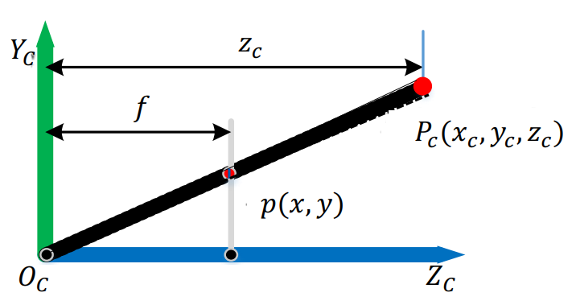
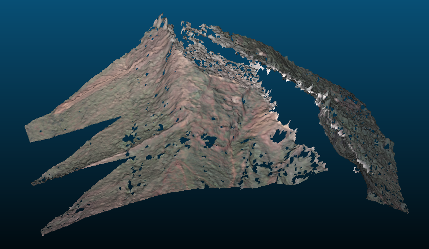
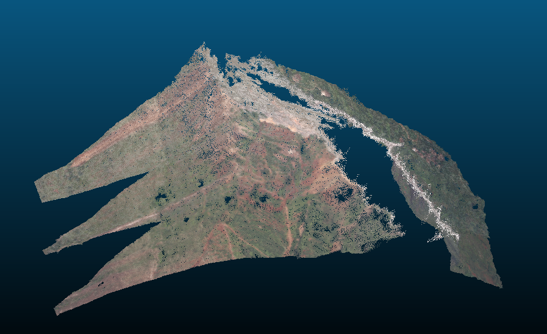

# HW4

## 4-1 推导相机内参矩阵的逆矩阵

### K​

$K = \begin{bmatrix}
f_\alpha & 0 & u_0\\
0 & f_\beta & v_0 \\
0 & 0 & 1
\end{bmatrix}$，其中$f_\alpha = f * \alpha$, $f_\beta = f * \beta$,$u_0 = \frac{weight}{2}$, $v_0 = \frac{height}{2}$。

坐标转换公式为：$(u, v) = (f * \alpha * x + \frac{weight}{2}, f * \beta * y + \frac{height}{2})$

对于世界坐标系下的$x$，做了以下操作：

- $*f$：将$x$由归一化像平面转到物理像平面

- $* \alpha$：因为$\frac{1}{\alpha}$是像素宽，所以这相当于除以像素宽，也就是将物理像平面上的x坐标的单位由mm转为像素。
- $+\frac{weight}{2}$：坐标系平移

`fill_calibration`中：

```cpp
if (image_aspect < 1.0f) /* Portrait. */
{
    ax = this->flen * height / this->paspect;
    ay = this->flen * height;
}
else /* Landscape. */
{
    ax = this->flen * width;
    ay = this->flen * width * this->paspect;
}

mat[0] =   ax; mat[1] = 0.0f; mat[2] = width * this->ppoint[0];
mat[3] = 0.0f; mat[4] =   ay; mat[5] = height * this->ppoint[1];
mat[6] = 0.0f; mat[7] = 0.0f; mat[8] = 1.0f;
```

`this->paspect`默认为`1.0`，`this->ppoint`默认为`[0.5 0.5]`。

令`a = max(width, height)`，它等于公式里的$\alpha$及$\beta$，而像素宽为$\frac{1}{a}$。

则公式里的$f_\alpha$等于代码里的`ax = this->flen * a`；$f_\beta$等于代码里的`ay = this->flen * a`。

公式里的$u_0 = \frac{weight}{2}$等于代码里的`width * this->ppoint[0]`；$v_0 = \frac{height}{2}$等于代码里的`height * this->ppoint[1]`。

### $K^{-1}$

$K^{-1} = \frac{1}{f_\alpha f_\beta}\begin{bmatrix}
f_\beta & 0 & 0\\
0 & f_\alpha & 0 \\
-u_0f_\beta & -v_0f_\alpha & f_a f_\beta
\end{bmatrix}^T = \frac{1}{f_\alpha f_\beta}\begin{bmatrix}
f_\beta & 0 & -u_0f_\beta\\
0 & f_\alpha & -v_0f_\alpha \\
0 & 0 & f_\alpha f_\beta
\end{bmatrix} = \begin{bmatrix}
\frac{1}{f_\alpha} & 0 & -\frac{u_0}{f_\alpha}\\
0 & \frac{1}{f_\beta} & -\frac{v_0}{f_\beta} \\
0 & 0 & 1
\end{bmatrix}$

`fill_inverse_calibration`中：

```cpp
if (image_aspect < 1.0f) /* Portrait. */
{
    ax = this->flen * height / this->paspect;
    ay = this->flen * height;
}
else /* Landscape. */
{
    ax = this->flen * width;
    ay = this->flen * width * this->paspect;
}

mat[0] = 1.0f / ax; mat[1] = 0.0f; mat[2] = -width * this->ppoint[0] / ax;
mat[3] = 0.0f; mat[4] = 1.0f / ay; mat[5] = -height * this->ppoint[1] / ay;
mat[6] = 0.0f; mat[7] = 0.0f;      mat[8] = 1.0f;
```

把刚刚算出来的$f_\alpha$,$f_\beta$,$u_0$,$v_0$代入$K^{-1}$的公式中，可发现与代码一致。

## 4-2 图像分辨率的估计  

设$r$为空间中一个球体的直径，如果将它投影到图像上，圆的直径将会是一个像素宽。

参考课件上的图片：



$z_c$为三维点深度，$f$为相机焦距，两者单位皆为mm。

利用相似三角形的关系，可以推得$\frac{f}{z_c} = \frac{1}{r}$，所以$r = \frac{z_c}{f}$。注意等号右边的分子的单位是像素，所以算出来的$r$的单位也是像素。

上面$r$的单位是像素，如果要将它转成mm，需将它乘上像素宽，即$\frac{z_c}{f} * \frac{1}{a}$。

对照`footPrint`及`footPrintScaled`：

```cpp
inline float
SingleView::footPrint(math::Vec3f const& point)
{
    return (this->worldToCam.mult(point, 1)[2] * this->source_level.invproj[0]);
}

inline float
SingleView::footPrintScaled(math::Vec3f const& point)
{
    assert(this->has_target_level);
    return (this->worldToCam.mult(point, 1)[2] * this->target_level.invproj[0]);
}
```

`this->worldToCam.mult(point, 1)[2]`表示将世界坐标系中的三维点`point`转换到相机坐标系，再取z坐标，也就是深度，即公式里的$z_c$。

`this->source_level.invproj[0]`为$K^{-1}$第0个元素，即$\frac{1}{f_\alpha} = \frac{1}{f * a}$。

## 4-3 推导求导公式

### optimizeDepthAndNormal

对每个邻域视角，都调用`fastColAndDeriv`来计算`nDeriv`。`nDeriv[i][c]`代表邻域视角patch里第`i`个像素的颜色`c`对深度的导数。

```cpp
Samples nCol, nDeriv;
sampler->fastColAndDeriv(*id, nCol, nDeriv);
```

### fastColAndDeriv

对于邻域视角`views[v]`，采用图像金字塔上第`mmLevel`层的图像。

`p0`：patch中心点所对应三维点的坐标。

```cpp
math::Vec3f const& p0 = patchPoints[nrSamples/2];
```

`p1`：`p0`往视线方向`masterViewDirs[i]`移动一单位。

```cpp
math::Vec3f p1(p0 + masterViewDirs[nrSamples/2]);
```

`d`：`p0`与`p1`投影到图像上后的距离。

```cpp
float d = (views[v]->worldToScreen(p1, mmLevel) - views[v]->worldToScreen(patchPoints[12], mmLevel)).norm();
if (!(d > 0.f)) {
    return;
}
```

`stepSize[v]`：上述距离的倒数。

```cpp
stepSize[v] = 1.f / d;
```

`p0`：patch上第`i`个像素点所对应的三维点坐标。

```cpp
math::Vec3f p0(patchPoints[i]);
```

`p1`：三维点`p0`在深度方向`masterViewDirs[i]`移动`stepSize[v]`单位。结合上面的代码，可以得知`p0`与`p1`投影到图像上后的距离应为$d * stepSize[v] = d / d = 1$个像素点。

```cpp
math::Vec3f p1(patchPoints[i] + masterViewDirs[i] * stepSize[v]);
```

`gradDir[i]`：将`p0`与`p1`投影到图像后，二维点在x和y方向上的变化量。此处`gradDir[i]`的norm应为1。它的分子是二维点坐标的变化量，分母是深度的变化量，因此我们可以将它想成是图像上二维点坐标对深度的导数（但是需记住这里的分母是`stepSize[v]`而不是1）。

```cpp
imgPos[i] = views[v]->worldToScreen(p0, mmLevel);
// ...
gradDir[i] = views[v]->worldToScreen(p1, mmLevel) - imgPos[i];
```

算好了`gradDir`后，调用`colAndExactDeriv`计算`deriv`。

```cpp
colAndExactDeriv(*img, imgPos, gradDir, color, deriv);
```

因为当初算`gradDir`的分母是`stepSize[v]`，所以这里要进行归一化，让`gradDir`的分母变成1。

```cpp
/* normalize the gradient */  //fixme?? 为什么要进行归一化
for (std::size_t i = 0; i < nrSamples; ++i)
    deriv[i] /= stepSize[v];
```

### colAndExactDeriv

`imgPos` 为patch上三维点投影到图像上后的二维点坐标。

对`imgPos`里的每一个二维点（索引为`i`）都做以下的事情：

计算点位置到左边界的距离`x`及到上界的距离`y`：

```cpp
int const left = std::floor(imgPos[i][0]);
int const top = std::floor(imgPos[i][1]);
float const x = imgPos[i][0] - left;
float const y = imgPos[i][1] - top;
```

计算像素在`img`里的索引：

```cpp
int p0 = (top * width + left) * 3;
int p1 = ((top+1) * width + left) * 3;
```

`*3`表示三种颜色。`p0+3`表示`p0`右边像素点同一种颜色的索引；`p1`表示`p0`下面像素点同一种颜色的索引；`p1+3`表示`p0`右下角像素点同一种颜色的索引。

在x方向上对三种颜色做内插，权重与距离成反比。

```cpp
float x0, x1, x2, x3, x4, x5;
x0 = (1.f-x) * srgb2lin[img.at(p0  )] + x * srgb2lin[img.at(p0+3)];
x1 = (1.f-x) * srgb2lin[img.at(p0+1)] + x * srgb2lin[img.at(p0+4)];
x2 = (1.f-x) * srgb2lin[img.at(p0+2)] + x * srgb2lin[img.at(p0+5)];
x3 = (1.f-x) * srgb2lin[img.at(p1  )] + x * srgb2lin[img.at(p1+3)];
x4 = (1.f-x) * srgb2lin[img.at(p1+1)] + x * srgb2lin[img.at(p1+4)];
x5 = (1.f-x) * srgb2lin[img.at(p1+2)] + x * srgb2lin[img.at(p1+5)];
```

在y方向再内插一次，得到双线性内插后的三种颜色的值。

```cpp
color[i][0] = (1.f - y) * x0 + y * x3;
color[i][1] = (1.f - y) * x1 + y * x4;
color[i][2] = (1.f - y) * x2 + y * x5;
```

观察`deriv[i][c]`的计算方式：

```cpp
deriv[i][c] =
    u * (srgb2lin[img.at(p0+3)] - srgb2lin[img.at(p0)])
    + v * (srgb2lin[img.at(p1)] - srgb2lin[img.at(p0)])
    + (v * x + u * y) *
    (srgb2lin[img.at(p0)] - srgb2lin[img.at(p0+3)]
     - srgb2lin[img.at(p1)] + srgb2lin[img.at(p1+3)]);
```

把关于`u`的项跟关于`v`的项分离：

```cpp
u * (srgb2lin[img.at(p0+3)] - srgb2lin[img.at(p0)]) + 
    u * y * (srgb2lin[img.at(p0)] - srgb2lin[img.at(p0+3)]
             - srgb2lin[img.at(p1)] + srgb2lin[img.at(p1+3)]) + 
v * (srgb2lin[img.at(p1)] - srgb2lin[img.at(p0)]) + 
    (v * x) * (srgb2lin[img.at(p0)] - srgb2lin[img.at(p0+3)]
    - srgb2lin[img.at(p1)] + srgb2lin[img.at(p1+3)])
```

整理关于`u`的项：

```cpp
u * (srgb2lin[img.at(p0+3)] - srgb2lin[img.at(p0)]) + 
    u * y * (srgb2lin[img.at(p0)] - srgb2lin[img.at(p0+3)]
    - srgb2lin[img.at(p1)] + srgb2lin[img.at(p1+3)])
= u * (1-y) * (srgb2lin[img.at(p0+3)] - srgb2lin[img.at(p0)]) + 
    u * y * (srgb2lin[img.at(p1+3)] - srgb2lin[img.at(p1)])
= u * [y * (srgb2lin[img.at(p1+3)] - srgb2lin[img.at(p1)]) + 
    (1-y) * (srgb2lin[img.at(p0+3)] - srgb2lin[img.at(p0)])]
```

`(srgb2lin[img.at(p1+3)] - srgb2lin[img.at(p1)])`表示右下与左下像素颜色的差，可以想成下方在`x`方向的导数（分子为颜色差值，分母为`x`方向的一个像素）；`(srgb2lin[img.at(p0+3)] - srgb2lin[img.at(p0)])`可以想成上方在`x`方向的导数。

然后在`y`方向内插，得到`[y * (srgb2lin[img.at(p1+3)] - srgb2lin[img.at(p1)]) + (1-y) * (srgb2lin[img.at(p0+3)] - srgb2lin[img.at(p0)])]`，即为在`imgPos[i][1]`处在`x`方向上的导数。

用相同的方式整理关于`v`的项：

```cpp
v * (srgb2lin[img.at(p1)] - srgb2lin[img.at(p0)]) + 
    (v * x) * (srgb2lin[img.at(p0)] - srgb2lin[img.at(p0+3)]
               - srgb2lin[img.at(p1)] + srgb2lin[img.at(p1+3)])
= v * (1-x) * (srgb2lin[img.at(p1)] - srgb2lin[img.at(p0)]) +
  v * x * (srgb2lin[img.at(p1+3)] - srgb2lin[img.at(p0+3)])
= v * [x * (srgb2lin[img.at(p1+3)] - srgb2lin[img.at(p0+3)]) + 
       (1-x) * (srgb2lin[img.at(p1)] - srgb2lin[img.at(p0)])]
```

得到`[x * (srgb2lin[img.at(p1+3)] - srgb2lin[img.at(p0+3)]) + (1-x) * (srgb2lin[img.at(p1)] - srgb2lin[img.at(p0)])]`，即为在`imgPos[i][0]`处在`y`方向上的导数。

现在可以将`deriv[i][c]`写成：

```cpp
deriv[i][c] = u * 颜色在x方向上的导数 + v * 颜色在y方向上的导数
```

这相当于颜色对二维点坐标导数与梯度（图像上二维点坐标对深度的导数）向量的内积：

$deriv[i][c] = (u, v) \cdot (颜色在x方向上的导数, 颜色在y方向上的导数)$

回顾我们要求的$\frac{\partial I_k(i,j)}{\partial h(s,t)}$，它是颜色对深度的导数，有了上面求出来的两个导数，这里可以尝试用chain rule将它展开看看，得到：

$\frac{\partial I_k(i,j)}{\partial h(s,t)} = \frac{\partial I_k(i,j)}{\partial i}\frac{\partial i}{\partial h(s,t)} + \frac{\partial I_k(i,j)}{\partial j}\frac{\partial j}{\partial h(s,t)}$

这正好与代码里的计算方式相吻合。

注：公式里是用`i`,`j`表示图像上的二维点坐标，代码里则是把patch摊开成一维的，只用了一个索引`i`。

## 4-4 运行代码

### dmrecon_single_view

```
root@8b278d111ec2:/d/3DReconstructionCourse/ImageBasedModellingEdu/build# ./examples/task4/task4-1_dmrecon_single_view ../exam
ples/data/sequence_scene/ 2 2
Loading scene...
Initializing scene with 7 views...
Initialized 7 views (max ID is 6), took 92ms.
Reading Photosynther file (7 cameras, 7029 features)...
Reconstructing view ID 2
scaled image size: 702 x 468
Global View Selection: 0 1 3 4 5 6
Loading color images...
Processing 7029 features...
Processed 3463 features, from which 2795 succeeded optimization.
Process queue ...
Count:        0  filled:     2349  Queue:     2486
Count:      867  filled:     3000  Queue:     3290
Count:     2418  filled:     4000  Queue:     4255
Count:     4062  filled:     5000  Queue:     5185
Count:     5620  filled:     6000  Queue:     6096
Count:     7158  filled:     7000  Queue:     7010
Count:     8847  filled:     8000  Queue:     7741
Count:    10602  filled:     9000  Queue:     8458
Count:    12392  filled:    10000  Queue:     9193
Count:    14077  filled:    11000  Queue:     9954
Count:    15781  filled:    12000  Queue:    10733
Count:    17622  filled:    13000  Queue:    11375
Count:    19446  filled:    14000  Queue:    12006
Count:    21135  filled:    15000  Queue:    12812
Count:    22999  filled:    16000  Queue:    13377
Count:    24742  filled:    17000  Queue:    14088
Count:    26654  filled:    18000  Queue:    14653
Count:    28566  filled:    19000  Queue:    15215
Count:    30283  filled:    20000  Queue:    15946
Count:    32237  filled:    21000  Queue:    16474
Count:    34016  filled:    22000  Queue:    17146
Count:    35817  filled:    23000  Queue:    17818
Count:    37809  filled:    24000  Queue:    18286
Count:    39770  filled:    25000  Queue:    18803
Count:    41754  filled:    26000  Queue:    19375
Count:    43674  filled:    27000  Queue:    19970
Count:    45454  filled:    28000  Queue:    20697
Count:    47184  filled:    29000  Queue:    21447
Count:    49154  filled:    30000  Queue:    22035
Count:    51152  filled:    31000  Queue:    22541
Count:    53185  filled:    32000  Queue:    23012
Count:    55145  filled:    33000  Queue:    23527
Count:    57091  filled:    34000  Queue:    24014
Count:    59375  filled:    35000  Queue:    24264
Count:    61328  filled:    36000  Queue:    24810
Count:    63326  filled:    37000  Queue:    25326
Count:    65311  filled:    38000  Queue:    25801
Count:    67424  filled:    39000  Queue:    26197
Count:    69510  filled:    40000  Queue:    26594
Count:    71568  filled:    41000  Queue:    27103
Count:    73572  filled:    42000  Queue:    27597
Count:    75443  filled:    43000  Queue:    28219
Count:    77506  filled:    44000  Queue:    28680
Count:    79660  filled:    45000  Queue:    29032
Count:    81449  filled:    46000  Queue:    29766
Count:    83452  filled:    47000  Queue:    30211
Count:    85591  filled:    48000  Queue:    30572
Count:    87963  filled:    49000  Queue:    30744
Count:    90136  filled:    50000  Queue:    31170
Count:    92241  filled:    51000  Queue:    31562
Count:    94471  filled:    52000  Queue:    31816
Count:    96411  filled:    53000  Queue:    32350
Count:    98254  filled:    54000  Queue:    33025
Count:   100321  filled:    55000  Queue:    33445
Count:   102432  filled:    56000  Queue:    33954
Count:   104639  filled:    57000  Queue:    34245
Count:   106692  filled:    58000  Queue:    34820
Count:   109385  filled:    59000  Queue:    34641
Count:   111716  filled:    60000  Queue:    34945
Count:   113788  filled:    61000  Queue:    35442
Count:   115982  filled:    62000  Queue:    35803
Count:   117735  filled:    63000  Queue:    36563
Count:   119713  filled:    64000  Queue:    37161
Count:   122006  filled:    65000  Queue:    37427
Count:   124295  filled:    66000  Queue:    37739
Count:   126877  filled:    67000  Queue:    37823
Count:   129176  filled:    68000  Queue:    38069
Count:   131535  filled:    69000  Queue:    38330
Count:   134017  filled:    70000  Queue:    38454
Count:   136446  filled:    71000  Queue:    38668
Count:   138760  filled:    72000  Queue:    38962
Count:   140964  filled:    73000  Queue:    39355
Count:   143266  filled:    74000  Queue:    39709
Count:   145163  filled:    75000  Queue:    40404
Count:   147540  filled:    76000  Queue:    40744
Count:   150044  filled:    77000  Queue:    40781
Count:   151920  filled:    78000  Queue:    41386
Count:   153786  filled:    79000  Queue:    42054
Count:   156158  filled:    80000  Queue:    42264
Count:   158470  filled:    81000  Queue:    42561
Count:   160821  filled:    82000  Queue:    42761
Count:   163396  filled:    83000  Queue:    42875
Count:   165739  filled:    84000  Queue:    43110
Count:   168071  filled:    85000  Queue:    43349
Count:   170458  filled:    86000  Queue:    43581
Count:   172926  filled:    87000  Queue:    43741
Count:   175515  filled:    88000  Queue:    43813
Count:   177960  filled:    89000  Queue:    44068
Count:   180634  filled:    90000  Queue:    44049
Count:   183476  filled:    91000  Queue:    43883
Count:   186063  filled:    92000  Queue:    43908
Count:   188607  filled:    93000  Queue:    44119
Count:   190633  filled:    94000  Queue:    44701
Count:   193373  filled:    95000  Queue:    44715
Count:   196386  filled:    96000  Queue:    44345
Count:   199368  filled:    97000  Queue:    43981
Count:   201684  filled:    98000  Queue:    44272
Count:   204561  filled:    99000  Queue:    44185
Count:   206957  filled:   100000  Queue:    44472
Count:   209561  filled:   101000  Queue:    44611
Count:   212109  filled:   102000  Queue:    44833
Count:   214911  filled:   103000  Queue:    44773
Count:   217700  filled:   104000  Queue:    44763
Count:   220597  filled:   105000  Queue:    44726
Count:   223325  filled:   106000  Queue:    44740
Count:   225711  filled:   107000  Queue:    45101
Count:   228245  filled:   108000  Queue:    45308
Count:   230850  filled:   109000  Queue:    45412
Count:   233744  filled:   110000  Queue:    45269
Count:   236535  filled:   111000  Queue:    45281
Count:   239345  filled:   112000  Queue:    45191
Count:   242068  filled:   113000  Queue:    45166
Count:   244928  filled:   114000  Queue:    45119
Count:   248055  filled:   115000  Queue:    44855
Count:   250345  filled:   116000  Queue:    45289
Count:   253026  filled:   117000  Queue:    45416
Count:   256522  filled:   118000  Queue:    44722
Count:   259568  filled:   119000  Queue:    44540
Count:   262757  filled:   120000  Queue:    44195
Count:   266204  filled:   121000  Queue:    43574
Count:   269012  filled:   122000  Queue:    43651
Count:   271232  filled:   123000  Queue:    44102
Count:   273706  filled:   124000  Queue:    44343
Count:   277146  filled:   125000  Queue:    43844
Count:   279898  filled:   126000  Queue:    44030
Count:   283043  filled:   127000  Queue:    43737
Count:   285924  filled:   128000  Queue:    43694
Count:   289510  filled:   129000  Queue:    43065
Count:   292550  filled:   130000  Queue:    42931
Count:   295955  filled:   131000  Queue:    42339
Count:   299403  filled:   132000  Queue:    41797
Count:   301816  filled:   133000  Queue:    42116
Count:   305047  filled:   134000  Queue:    41700
Count:   308809  filled:   135000  Queue:    40920
Count:   312093  filled:   136000  Queue:    40486
Count:   315919  filled:   137000  Queue:    39756
Count:   319763  filled:   138000  Queue:    38746
Count:   324254  filled:   139000  Queue:    37331
Count:   328653  filled:   140000  Queue:    35902
Count:   332808  filled:   141000  Queue:    34729
Count:   336375  filled:   142000  Queue:    34068
Count:   340467  filled:   143000  Queue:    33021
Count:   344803  filled:   144000  Queue:    31697
Count:   349231  filled:   145000  Queue:    30309
Count:   355297  filled:   146000  Queue:    27437
Count:   359886  filled:   147000  Queue:    25858
Count:   365270  filled:   148000  Queue:    23523
Count:   370464  filled:   149000  Queue:    21395
Count:   375065  filled:   150000  Queue:    19737
Count:   382927  filled:   151000  Queue:    14917
Count:   390279  filled:   152000  Queue:    10729
Count:   395981  filled:   153000  Queue:     7952
Count:   406868  filled:   154000  Queue:      195
Filled 154034 pixels, i.e. 46.9 %.
MVS took 819 seconds.
Reconstruction took 821279ms.
Saving views back to disc...
Saving views to MVE files... done.
```

### scene2pset_single_view

```
root@8b278d111ec2:/d/3DReconstructionCourse/ImageBasedModellingEdu/build# ./examples/task4/task4-1_scene2pset_single_view ../examples/data/sequence_scene/ ../examples/data/sequence_scene/points.ply 2 2
Using depthmap "depth-L2" and color image "undist-L2"
Initializing scene with 7 views...
Initialized 7 views (max ID is 6), took 76ms.
Processing view "IMG_0193" (with colors)...
Writing final point set (153989 points)...
Writing PLY file (153989 verts, with colors, with normals, 297299 faces)... done.
```



### 全局视角选择

```cpp
void GlobalViewSelection::performVS(){

    selected.clear();
    bool foundOne = true;
    // foundOne: 如果在某次迭代過程中都沒有選到視角,就會跳出
    while (foundOne && (selected.size() < settings.globalVSMax/*最多要选择的视角个数*/)){
        float maxBenefit = 0.f;
        std::size_t maxView = 0;
        foundOne = false;
        /*遍历所有的视角，找到score最大的一个视角，将该视角放入selected中，后续会抑制所有和该视角基线较小的视角被选择*/
        for (std::size_t i = 0; i < views.size(); ++i){

            /*视角不可用则跳过*/
            if (!available[i])
                continue;

            /*计算参考视角和第i个视角之间的score*/
            float benefit = benefitFromView(i);
            if (benefit > maxBenefit) {
                maxBenefit = benefit;
                maxView = i;
                foundOne = true;
            }
        }
        if (foundOne) {
            selected.insert(maxView);
            available[maxView] = false;
        }
    }
}
```

在每次迭代过程中，会遍历所有视角，跳过不可用（`!available[i]`）的视角，选择其中score最高的，将它放入`selected`集合中。

如果有某一次无法选出合适的视角，将导致`foundOne`为false，下次便会退出循环。另外如果已选择的视角数量已经达到`settings.globalVSMax`，也会退出循环。

全局视角分数`score`的计算主要依赖于以下几点：

- 图像具有相同的内容， 外观—通过共享sift特征点的个数

  这一点在代码里是透过循环遍历的次数来实现

  ```cpp
  for (std::size_t k = 0; k < nFeatIDs.size(); ++k) {
      //...
      benefit += score;
  }
  ```

- 图像具有足够大的视差（宽基线） --通过视线的夹角

  如果视差小于10度会降低score。

  ```cpp
  float plx = parallax(ftPos, refV, tmpV);
  if (plx < settings.minParallax)
      score *= sqr(plx / 10.f);
  ```

- 图像具有相似的分辨率-- 通过计算投影球半径

  `footPrint`及`footPrintScaled`计算投影球半径，即论文里的$s_R(f)$和$s_V(f)$。

  两者相除得$r = s_R(f)/s_V(f)$，计算$w_s(f)$：

  $w_s(f) = \begin{cases}
  		2/r, & \text{2 < r}\\
  		1,& \text{1 <= r < 2}\\
  		r,& \text{r < 1}\\
   \end{cases}$
  
  然后在$r$大于2或小于1时，降低score。
  
  ```cpp
  float mfp = refV->footPrintScaled(ftPos);
  float nfp = tmpV->footPrint(ftPos);
  float ratio = mfp / nfp;
  // reference view
  if (ratio > 2.)
      ratio = 2. / ratio;
  else if (ratio > 1.)
      ratio = 1.;
  score *= ratio;
  ```

- 考虑每个特征在参考图像与已选择图像的视线夹角—排它性  

  ```cpp
  // Parallax with other selected views that see the same feature
  IndexSet::const_iterator citV;
  for (citV = selected.begin(); citV != selected.end(); ++citV) {
      plx = parallax(ftPos, views[*citV], tmpV);
      if (plx < settings.minParallax)
          score *= sqr(plx / 10.f);
  }
  ```

### 局部视角选择

```cpp
void LocalViewSelection::performVS(){

    /**
     * 如果选择的视角个数等于设定的个数，则不需要再进行局部视角选择
     */
    if (selected.size() == settings.nrReconNeighbors) {
        success = true;
        return;
    }

    /*获取参考视角*/
    SingleView::Ptr refV = views[settings.refViewNr];

    /*获取patch的中心点*/
    math::Vec3f p(sampler->getMidWorldPoint());

    // pixel print in reference view
    float mfp = refV->footPrintScaled(p);
    math::Vec3f refDir = (p - refV->camPos).normalized();

    /*计算patch在参考视角和其他所有视角的的ncc, 极平面的法向量*/
    std::map<std::size_t, math::Vec3f> viewDir;
    std::map<std::size_t, math::Vec3f> epipolarPlane; // plane normal
    std::map<std::size_t, float> ncc;
    for (std::size_t i = 0; i < views.size(); ++i) {
        if (!available[i])
            continue;
        /*计算patch在第i个视角和参考视角的NCC值*/
        float tmpNCC = sampler->getFastNCC(i);

        /*如果NCC的值小于设定的阈值*/
        assert(!MATH_ISNAN(tmpNCC));
        if (tmpNCC < settings.minNCC) {
            available[i] = false;
            continue;
        }

        ncc[i] = tmpNCC;

        /*计算极平面之间的法向量*/
        viewDir[i] = (p - views[i]->camPos).normalized();
        epipolarPlane[i] = (viewDir[i].cross(refDir)).normalized();
    }

    /*对于所有的已经选择的视角，计算极平面的法向量*/
    IndexSet::const_iterator sel;
    for (sel = selected.begin(); sel != selected.end(); ++sel) {
        viewDir[*sel] = (p - views[*sel]->camPos).normalized();
        epipolarPlane[*sel] = (viewDir[*sel].cross(refDir)).normalized();
    }


    bool foundOne = true;
    while (selected.size() < settings.nrReconNeighbors && foundOne){
        foundOne = false;
        std::size_t maxView = 0;
        float maxScore = 0.f;
        for (std::size_t i = 0; i < views.size(); ++i) {
            if (!available[i])
                continue;
            float score = ncc[i];

            // 1. 考虑分辨率差异--计算参考视角和第i个视角的尺度
            // resolution difference
            float nfp = views[i]->footPrint(p);
            if (mfp / nfp < 0.5f) {  //todo  第i个视角的分辨率高于参考视角分分辨率？？
                score *= 0.01f;
            }

            // 2. 考虑视线之间的夹角
            // parallax w.r.t. reference view
            float dp = math::clamp(refDir.dot(viewDir[i]), -1.f, 1.f);
            float plx = std::acos(dp) * 180.f / pi;
            score *= parallaxToWeight(plx);
            assert(!MATH_ISNAN(score));

            /*3. 考虑和其它已经选择的视角之间的关联*/
            for (sel = selected.begin(); sel != selected.end(); ++sel) {
                // parallax w.r.t. other selected views
                dp = math::clamp(viewDir[*sel].dot(viewDir[i]), -1.f, 1.f);
                plx = std::acos(dp) * 180.f / pi;
                score *= parallaxToWeight(plx);

                // epipolar geometry
                dp = epipolarPlane[i].dot(epipolarPlane[*sel]);
                dp = math::clamp(dp, -1.f, 1.f);
                float angle = std::abs(std::acos(dp) * 180.f / pi);
                if (angle > 90.f)
                    angle = 180.f - angle;

                angle = std::max(angle, 1.f);
                if (angle < settings.minParallax)
                    score *= angle / settings.minParallax;
                assert(!MATH_ISNAN(score));
            }

            /*如果score> maxScore*/
            if (score > maxScore) {
                foundOne = true;
                maxScore = score;
                maxView = i;
            }
        }

        if (foundOne) {
            selected.insert(maxView);
            available[maxView] = false;
        }
    }

    /*如果选择的视角个数等于设定的个数，则表示选择成功*/
    if (selected.size() == settings.nrReconNeighbors) {
        success = true;
    }
}
```

首先遍历所有视角，略过不可用的视角（`!available[i]`）及ncc小于阈值（0.3）的视角。

```cpp
if (!available[i])
    continue;
/*计算patch在第i个视角和参考视角的NCC值*/
float tmpNCC = sampler->getFastNCC(i);

/*如果NCC的值小于设定的阈值*/
assert(!MATH_ISNAN(tmpNCC));
if (tmpNCC < settings.minNCC) {
    available[i] = false;
    continue;
}
```

对它们计算ncc，视线方向及极平面法向量：

```cpp
float tmpNCC = sampler->getFastNCC(i);
//...
ncc[i] = tmpNCC;
/*计算极平面之间的法向量*/
viewDir[i] = (p - views[i]->camPos).normalized();
epipolarPlane[i] = (viewDir[i].cross(refDir)).normalized();
```

接着对已选择的视角计算视线方向及极平面法向量：

```cpp
IndexSet::const_iterator sel;
for (sel = selected.begin(); sel != selected.end(); ++sel) {
    viewDir[*sel] = (p - views[*sel]->camPos).normalized();
    epipolarPlane[*sel] = (viewDir[*sel].cross(refDir)).normalized();
}
```

接着开始进行局部视角选择。在每次迭代过程中，会遍历所有视角，跳过不可用（`!available[i]`）的视角，选择其中score最高的，将它放入`selected`集合中。

局部视角分数`score`的计算主要依赖于以下几点：

- NCC值

  ```cpp
  float score = ncc[i];
  ```

- 考虑分辨率差异--计算参考视角和第i个视角的尺度

  `nfp`及`mfp`为投影球半径，与分辨率成反相关。

  如果候选视角的分辨率远小于参考视角的分辨率，则降低score：

  ```cpp
  // resolution difference
  float nfp = views[i]->footPrint(p);
  if (mfp / nfp < 0.5f) {  //todo  第i个视角的分辨率高于参考视角分分辨率？？
      score *= 0.01f;
  }
  ```

  （不考虑候选视角的分辨率远大于参考视角的分辨率的情况？）

- 考虑视线之间的夹角

  计算视差然后用视差计算要乘到`score`上的权重：

  ```cpp
  // parallax w.r.t. reference view
  float dp = math::clamp(refDir.dot(viewDir[i]), -1.f, 1.f);
  float plx = std::acos(dp) * 180.f / pi;
  score *= parallaxToWeight(plx);
  assert(!MATH_ISNAN(score));
  ```

  查看`parallaxToWeight`，权重与视差`plx`成正相关：

  ```cpp
  inline float
  parallaxToWeight(float p){
      if (p < 0.f || p > 180.f) {
          std::cerr << "ERROR: invalid parallax value." << std::endl;
          return 0.f;
      }
      float sigma;
      if (p <= 20.f)
          sigma = 5.f;
      else
          sigma = 15.f;
  
      float mean = 20.f;
      return exp(- sqr(p - mean) / (2 * sigma * sigma));
  }
  ```

- 考虑和其它已经选择的视角之间的关联

  遍历所有已经选择的视角，做以下的事情：

  - 考虑视线之间的夹角（不能太小）

    ```cpp
    // parallax w.r.t. other selected views
    dp = math::clamp(viewDir[*sel].dot(viewDir[i]), -1.f, 1.f);
    plx = std::acos(dp) * 180.f / pi;
    score *= parallaxToWeight(plx);
    ```

  - 极平面要足够分散（不共面）

    首先计算极平面法向量间的夹角`angle`，如果`angle`小于10度，就会降低score。。

    ```cpp
    // epipolar geometry
    dp = epipolarPlane[i].dot(epipolarPlane[*sel]);
    dp = math::clamp(dp, -1.f, 1.f);
    float angle = std::abs(std::acos(dp) * 180.f / pi);
    if (angle > 90.f)
        angle = 180.f - angle;
    
    angle = std::max(angle, 1.f);
    if (angle < settings.minParallax)
        score *= angle / settings.minParallax;
    assert(!MATH_ISNAN(score));
    ```

### 单幅图像重建的流程

```cpp
FUNCTION DMRecon::开始()
    BEGIN
        SET 进度.开始时间 TO 获取当前时间()

        // 对稀疏特征进行重建
        对稀疏特征进行重建()

        // 全局视角选择
        全局视角选择()

        // 处理特征，对当前的三维点投影到图像上进行深度值估计
        // 并且将重建的特征点添加到队列中，作为种子点
        处理特征()

        // 处理队列
        处理队列()

        // Save images to view
        // 保存图像相关代码
        // ...
    EXCEPTION e
        IF (!设定.保持安静) THEN
            PRINT "Reconstruction failed: ", e
		END IF
        
        SET 进度.状态 TO 重建_取消
        返回
    END
END FUNCTION
```

#### 区域生长重建过程

```cpp
FUNCTION DMRecon::处理队列()
    SET 进度.状态 TO 重建_队列
    IF (进度.是否取消) THEN 返回 END IF

    // 当前的参考视角
    SET 参考视角 TO this->视角容器[设定.参考视角的号码]

    IF (!设定.保持安静) THEN
        PRINT "Process queue ..."
	END IF
    
    INIT 已处理的队列元素个数, 上次已填满的像素数量
    SET 已处理的队列元素个数 TO 0
    SET 上次已填满的像素数量 TO 1
    SET 进度.队列大小 TO 优先队列.大小()

    // 初始状态
    IF (!设定.保持安静) THEN
        PRINT "Count: ", 已处理的队列元素个数
                  , "  filled: ", 进度.已填满的像素数量  // 填充深度值的像素个数
                  , "  Queue: ", 进度.队列大小  // 队列中的种子点个数
    END IF
    SET 上次已填满的像素数量 TO 进度.已填满的像素数量

    // 队列不为空
    WHILE (!优先队列.是否为空() && !进度.是否取消)

        SET 进度.队列大小 TO 优先队列.大小()

        // 每填充1000个像素并且填充像素在增加，则打印输出填充结果
        IF ((进度.已填满的像素数量 % 1000 == 0) && (进度.已填满的像素数量 != 上次已填满的像素数量)) THEN
            IF (!设定.保持安静) THEN
                PRINT "Count: ", 已处理的队列元素个数,
    				  "  filled: ", 进度.已填满的像素数量,
                      "  Queue: ", 进度.队列大小
            END IF
            SET 上次已填满的像素数量 TO 进度.已填满的像素数量
        END IF

        // 取出第一个种子点
        SET tmpData TO 优先队列.最上面的元素()
        // 去除种子点
        优先队列.弹出()
        SET 已处理的队列元素个数 TO 已处理的队列元素个数 + 1
        INIT 像素x坐标, 像素y坐标
        SET 像素x坐标 TO tmpData.像素x坐标
        SET 像素y坐标 TO tmpData.像素y坐标
        SET 像素索引 TO 像素y坐标 * this->图像宽度 + 像素x坐标

        //此处应该是相等的
        IF (参考视角->置信度图->at(像素索引) > tmpData.置信度) THEN
            继续WHILE循环
        END IF

        /**进行patch 优化**/
        INIT patch
        SET patch to PatchOptimization(视角容器, 设定, 像素x坐标, 像素y坐标, tmpData.深度,
            tmpData.深度在i方向的变化率, tmpData.深度在j方向的变化率, 全局视角id的容器, tmpData.局部视角id的容器)
        patch.自动优化()
        SET tmpData.置信度 TO patch.计算置信度()

        /*优化后的confidence<0 则抛除*/
        IF (tmpData.置信度 == 0) THEN
            继续WHILE循环
        END IF

        INIT 新深度
        SET 新深度 TO patch.获取深度()
        SET tmpData.深度 TO 新深度
        SET tmpData.深度在i方向的变化率 TO patch.获取深度在i方向的变化率()
        SET tmpData.深度在j方向的变化率 TO patch.获取深度在j方向的变化率()
        SET 法向量 TO patch.获取法向量()
        SET tmpData.局部视角id的容器 TO patch.获取局部视角()

        // 之前没有被优化过的点
        IF (参考视角->置信度图->at(像素索引) <= 0) THEN
            SET 进度.已填满的像素数量 TO 进度.已填满的像素数量+1
        END IF
        // 优化后性能有了提升的点
        IF (参考视角->置信度图->at(像素索引) < tmpData.置信度) THEN
            SET 参考视角->深度图->at(像素索引) TO tmpData.深度
            SET 参考视角->法向量图->at(像素索引, 0) TO 法向量[0]
            SET 参考视角->法向量图->at(像素索引, 1) TO 法向量[1]
            SET 参考视角->法向量图->at(像素索引, 2) TO 法向量[2]
            SET 参考视角->深度变化率图->at(像素索引, 0) TO tmpData.深度在i方向的变化率
            SET 参考视角->深度变化率图->at(像素索引, 1) TO tmpData.深度在j方向的变化率
            SET 参考视角->置信度图->at(像素索引) TO tmpData.置信度

            /***
             * 如果优化后的pixel confidence比neighboring pixel 的confidence好0.05以上， 那么将该pixel的初始化变量赋给
             * neighboring 像素继续进行优化，交替进行直到neigboring pixels的confidence小于一定的值
             */
            // left
            SET tmpData.像素x坐标 TO 像素x坐标 - 1
            SET tmpData.像素y坐标 TO 像素y坐标
            SET 像素索引 TO tmpData.像素y坐标 * this->图像宽度 + tmpData.像素x坐标

            IF (参考视角->置信度图->at(像素索引) < tmpData.置信度 - 0.05f ||
                参考视角->置信度图->at(像素索引) == 0.f) THEN
                优先队列.推入(tmpData)
            END IF
            // right
            SET tmpData.像素x坐标 TO 像素x坐标 + 1
            SET tmpData.像素y坐标 TO 像素y坐标
            SET 像素索引 TO tmpData.像素y坐标 * this->图像宽度 + tmpData.像素x坐标
            IF (参考视角->置信度图->at(像素索引) < tmpData.置信度 - 0.05f ||
                参考视角->置信度图->at(像素索引) == 0.f) THEN
                优先队列.推入(tmpData)
            END IF
            // top
            SET tmpData.像素x坐标 TO 像素x坐标
            SET tmpData.像素y坐标 TO 像素y坐标 - 1
            SET 像素索引 TO tmpData.像素y坐标 * this->图像宽度 + tmpData.像素x坐标
            IF (参考视角->置信度图->at(像素索引) < tmpData.置信度 - 0.05f ||
                参考视角->置信度图->at(像素索引) == 0.f) THEN
                优先队列.推入(tmpData)
            END IF
            // bottom
            SET tmpData.像素x坐标 TO 像素x坐标
            SET tmpData.像素y坐标 TO 像素y坐标 + 1
            SET 像素索引 TO tmpData.像素y坐标 * this->图像宽度 + tmpData.像素x坐标
            IF (参考视角->置信度图->at(像素索引) < tmpData.置信度 - 0.05f ||
                参考视角->置信度图->at(像素索引) == 0.f) THEN
                优先队列.推入(tmpData)
            END IF
        END IF
    END WHILE
END FUNCTION
```

#### 单个 patch 的优化过程

```cpp
FUNCTION Patch优化::自动优化()

    /**如果局部视角选择失败或者初始化失败或者color scale计算失败**/
    IF (!局部视角选择.是否成功 || !状态.优化是否成功) THEN
        返回
    END IF

    // first four iterations only refine depth
    WHILE ((状态.迭代次数 < 4) && (状态.优化是否成功))
        仅优化深度()
        SET 状态.迭代次数 TO 状态.迭代次数 + 1
    END WHILE

    INIT 是否有视角被移除, 是否收敛
    SET 是否有视角被移除 TO false
    SET 是否收敛 TO false
    WHILE (状态.迭代次数 < 设定.最大迭代次数 &&
        居于视角选择.是否成功 && 状态.优化是否成功)

        // 邻域视角
        INIT 邻域视角id容器
        SET 邻域视角id容器 TO 局部视角选择.获取被选择的视角id()

        // 保存当前每个邻域视角的NCC值
        INIT 老NCC值的容器
        FOR 邻域视角id IN 邻域视角id容器 
            // 快速的计算参考视角和当前视角的NCC值
            老NCC值的容器.加入(patch采样器->快速计算NCC(邻域视角id))
        END FOR

        // 当有视角移除或者优化一定次数之后，重新进行深度和法向量的优化，以及颜色尺度的计算
        // 否则仅仅优化深度值
        SET 状态.优化是否成功 TO false
        IF (状态.迭代次数 % 5 == 4 || 是否有视角被移除) THEN
            优化深度及法向量()
            计算颜色尺度()
            SET 是否有视角被移除 TO false
        ELSE IF
            仅优化深度()
        END IF

        IF (!状态.优化是否成功) THEN
            返回
        END IF
        
        // 检查每个视角
        SET 是否收敛 TO true
        INIT for循环迭代次数
        SET for循环迭代次数 TO 0
        INIT 需被替换的视角id的容器
        FOR 邻域视角id IN 邻域视角id容器
            SET for循环迭代次数 TO for循环迭代次数 + 1
            // 快速计算NCC
            INIT ncc
            SET ncc TO patch采样器->快速计算NCC(邻域视角id)

            // 有一个视角当前ncc的值比前一次迭代ncc的值大于一定的阈值，则未收敛
            IF (取绝对值(ncc - 老NCC值的容器[for循环迭代次数]) > 设定.minRefineDiff) THEN
                SET 是否收敛 TO false
            END IF

            // ncc的值小于可接受的范围或者优化次数达到一定值但是尚未收敛
            IF ((ncc < 设定.可接受的NCC值) || (状态.迭代次数 == 14 &&
                 取绝对值(ncc - 老NCC值的容器[for循环迭代次数]) > 设定.minRefineDiff)) THEN
                需被替换的视角id的容器.插入(邻域视角id)
                SET 是否有视角被移除 TO true
            END IF
        END FOR

        // 如果有视角移除，重新进行局部视角选择和重新计算颜色尺度
        IF (是否有视角被移除) THEN
            /*去除toBeReplaced视角，重新进行局部视角选择*/
            局部视角选择.替换视角(需被替换的视角id的容器)
            IF (!局部视角选择.是否成功) THEN
                返回
            END IF
            计算颜色尺度()
        ELSE IF (!状态.优化是否成功) THEN
            // all views valid but optimization failed -> give up
            返回
        ELSE IF (是否收敛) THEN
            SET 状态.是否收敛 TO true
            返回
        END IF
        SET 状态.迭代次数 TO 状态.迭代次数 + 1
    END WHILE
END FUNCTION
```

## 4-5 运行代码

### dmrecon_multi_views

```
root@8b278d111ec2:/d/3DReconstructionCourse/ImageBasedModellingEdu/build# ./examples/task4/task4-2_dmrecon_multi_views ../examples/data/sequence_scene/ 2
Initializing scene with 7 views...
Initialized 7 views (max ID is 6), took 68ms.
Reading Photosynther file (7 cameras, 7029 features)...
Reconstructing all views...
scaled image size: 702 x 468
Global View Selection: 1 2 3 4 5
Loading color images...
Processing 7029 features...
Processed 1458 features, from which 889 succeeded optimization.
Process queue ...
Count:        0  filled:      750  Queue:      783
Count:      361  filled:     1000  Queue:     1093
Count:     1901  filled:     2000  Queue:     2108
Count:     3511  filled:     3000  Queue:     3071
Count:     5210  filled:     4000  Queue:     3824
Count:     7065  filled:     5000  Queue:     4424
Count:     8638  filled:     6000  Queue:     5345
Count:    10518  filled:     7000  Queue:     5899
Count:    12471  filled:     8000  Queue:     6450
Count:    14495  filled:     9000  Queue:     6985
Count:    16371  filled:    10000  Queue:     7643
Count:    18346  filled:    11000  Queue:     8217
Count:    20375  filled:    12000  Queue:     8761
Count:    22717  filled:    13000  Queue:     9010
Count:    24440  filled:    14000  Queue:     9768
Count:    26485  filled:    15000  Queue:    10252
Count:    28665  filled:    16000  Queue:    10660
Count:    30728  filled:    17000  Queue:    11162
Count:    33295  filled:    18000  Queue:    11184
Count:    35437  filled:    19000  Queue:    11663
Count:    37458  filled:    20000  Queue:    12182
Count:    39450  filled:    21000  Queue:    12800
Count:    42007  filled:    22000  Queue:    12809
Count:    44664  filled:    23000  Queue:    12822
Count:    46586  filled:    24000  Queue:    13464
Count:    48955  filled:    25000  Queue:    13771
Count:    51124  filled:    26000  Queue:    14268
Count:    53258  filled:    27000  Queue:    14639
Count:    55644  filled:    28000  Queue:    14940
Count:    57608  filled:    29000  Queue:    15516
Count:    59839  filled:    30000  Queue:    15810
Count:    62090  filled:    31000  Queue:    16161
Count:    63905  filled:    32000  Queue:    16855
Count:    65872  filled:    33000  Queue:    17455
Count:    67943  filled:    34000  Queue:    17905
Count:    70282  filled:    35000  Queue:    18115
Count:    72337  filled:    36000  Queue:    18625
Count:    74292  filled:    37000  Queue:    19238
Count:    76326  filled:    38000  Queue:    19788
Count:    78193  filled:    39000  Queue:    20513
Count:    80878  filled:    40000  Queue:    20544
Count:    83481  filled:    41000  Queue:    20751
Count:    85865  filled:    42000  Queue:    21091
Count:    88803  filled:    43000  Queue:    21045
Count:    91317  filled:    44000  Queue:    21207
Count:    93818  filled:    45000  Queue:    21439
Count:    96486  filled:    46000  Queue:    21546
Count:    99686  filled:    47000  Queue:    21175
Count:   102792  filled:    48000  Queue:    20804
Count:   105908  filled:    49000  Queue:    20604
Count:   109572  filled:    50000  Queue:    19873
Count:   112266  filled:    51000  Queue:    19996
Count:   115598  filled:    52000  Queue:    19606
Count:   118713  filled:    53000  Queue:    19526
Count:   122139  filled:    54000  Queue:    19169
Count:   125917  filled:    55000  Queue:    18433
Count:   129548  filled:    56000  Queue:    17930
Count:   133444  filled:    57000  Queue:    17178
Count:   136718  filled:    58000  Queue:    16951
Count:   141013  filled:    59000  Queue:    15955
Count:   145308  filled:    60000  Queue:    14711
Count:   151499  filled:    61000  Queue:    11863
Count:   157545  filled:    62000  Queue:     9069
Count:   164839  filled:    63000  Queue:     5112
Count:   169641  filled:    64000  Queue:     3616
Filled 64496 pixels, i.e. 19.6 %.
MVS took 329 seconds.
scaled image size: 702 x 468
Global View Selection: 0 1 2 4 5 6
Loading color images...
Processing 7029 features...
Processed 4725 features, from which 2851 succeeded optimization.
Process queue ...
Count:        0  filled:     2380  Queue:     2525
Count:      851  filled:     3000  Queue:     3264
Count:     2349  filled:     4000  Queue:     4262
Count:     3869  filled:     5000  Queue:     5232
Count:     5453  filled:     6000  Queue:     6083
Count:     7105  filled:     7000  Queue:     6907
Count:     8739  filled:     8000  Queue:     7741
Count:    10421  filled:     9000  Queue:     8530
Count:    12100  filled:    10000  Queue:     9272
Count:    13857  filled:    11000  Queue:     9982
Count:    15588  filled:    12000  Queue:    10725
Count:    17310  filled:    13000  Queue:    11486
Count:    19026  filled:    14000  Queue:    12214
Count:    20791  filled:    15000  Queue:    12841
Count:    22552  filled:    16000  Queue:    13579
Count:    24312  filled:    17000  Queue:    14258
Count:    26137  filled:    18000  Queue:    14920
Count:    27869  filled:    19000  Queue:    15626
Count:    29720  filled:    20000  Queue:    16212
Count:    31549  filled:    21000  Queue:    16873
Count:    33272  filled:    22000  Queue:    17629
Count:    35122  filled:    23000  Queue:    18189
Count:    37029  filled:    24000  Queue:    18703
Count:    38846  filled:    25000  Queue:    19327
Count:    40716  filled:    26000  Queue:    19910
Count:    42612  filled:    27000  Queue:    20431
Count:    44617  filled:    28000  Queue:    20952
Count:    46346  filled:    29000  Queue:    21690
Count:    48311  filled:    30000  Queue:    22175
Count:    50176  filled:    31000  Queue:    22687
Count:    52249  filled:    32000  Queue:    23053
Count:    54165  filled:    33000  Queue:    23635
Count:    56280  filled:    34000  Queue:    23943
Count:    58277  filled:    35000  Queue:    24404
Count:    60405  filled:    36000  Queue:    24730
Count:    62606  filled:    37000  Queue:    24963
Count:    64805  filled:    38000  Queue:    25238
Count:    66851  filled:    39000  Queue:    25691
Count:    69022  filled:    40000  Queue:    26009
Count:    71036  filled:    41000  Queue:    26528
Count:    72917  filled:    42000  Queue:    27109
Count:    74899  filled:    43000  Queue:    27567
Count:    77278  filled:    44000  Queue:    27767
Count:    79084  filled:    45000  Queue:    28502
Count:    80875  filled:    46000  Queue:    29139
Count:    82907  filled:    47000  Queue:    29604
Count:    84898  filled:    48000  Queue:    30070
Count:    87156  filled:    49000  Queue:    30330
Count:    89482  filled:    50000  Queue:    30561
Count:    91765  filled:    51000  Queue:    30694
Count:    93807  filled:    52000  Queue:    31204
Count:    96082  filled:    53000  Queue:    31427
Count:    98162  filled:    54000  Queue:    31900
Count:   100285  filled:    55000  Queue:    32250
Count:   102699  filled:    56000  Queue:    32379
Count:   105042  filled:    57000  Queue:    32620
Count:   106875  filled:    58000  Queue:    33321
Count:   109128  filled:    59000  Queue:    33595
Count:   111271  filled:    60000  Queue:    34052
Count:   113602  filled:    61000  Queue:    34289
Count:   115405  filled:    62000  Queue:    35035
Count:   117350  filled:    63000  Queue:    35559
Count:   119288  filled:    64000  Queue:    36145
Count:   121514  filled:    65000  Queue:    36392
Count:   123669  filled:    66000  Queue:    36770
Count:   125996  filled:    67000  Queue:    37011
Count:   127870  filled:    68000  Queue:    37736
Count:   130205  filled:    69000  Queue:    37979
Count:   132220  filled:    70000  Queue:    38577
Count:   134572  filled:    71000  Queue:    38745
Count:   136777  filled:    72000  Queue:    39177
Count:   138860  filled:    73000  Queue:    39637
Count:   141097  filled:    74000  Queue:    39974
Count:   143398  filled:    75000  Queue:    40242
Count:   145757  filled:    76000  Queue:    40442
Count:   147824  filled:    77000  Queue:    40895
Count:   150040  filled:    78000  Queue:    41276
Count:   152513  filled:    79000  Queue:    41366
Count:   154319  filled:    80000  Queue:    42116
Count:   156511  filled:    81000  Queue:    42490
Count:   158910  filled:    82000  Queue:    42862
Count:   161133  filled:    83000  Queue:    43292
Count:   163006  filled:    84000  Queue:    43934
Count:   164962  filled:    85000  Queue:    44483
Count:   167140  filled:    86000  Queue:    44862
Count:   169251  filled:    87000  Queue:    45325
Count:   171380  filled:    88000  Queue:    45794
Count:   173355  filled:    89000  Queue:    46402
Count:   175823  filled:    90000  Queue:    46525
Count:   178250  filled:    91000  Queue:    46740
Count:   180790  filled:    92000  Queue:    46833
Count:   182819  filled:    93000  Queue:    47361
Count:   185348  filled:    94000  Queue:    47397
Count:   187605  filled:    95000  Queue:    47739
Count:   189969  filled:    96000  Queue:    47957
Count:   192401  filled:    97000  Queue:    48100
Count:   194739  filled:    98000  Queue:    48392
Count:   197110  filled:    99000  Queue:    48552
Count:   199169  filled:   100000  Queue:    49102
Count:   201362  filled:   101000  Queue:    49501
Count:   203900  filled:   102000  Queue:    49475
Count:   206646  filled:   103000  Queue:    49339
Count:   209350  filled:   104000  Queue:    49298
Count:   211284  filled:   105000  Queue:    49936
Count:   213592  filled:   106000  Queue:    50156
Count:   215897  filled:   107000  Queue:    50404
Count:   218371  filled:   108000  Queue:    50533
Count:   220903  filled:   109000  Queue:    50551
Count:   223874  filled:   110000  Queue:    50254
Count:   226204  filled:   111000  Queue:    50547
Count:   229079  filled:   112000  Queue:    50282
Count:   231647  filled:   113000  Queue:    50358
Count:   234414  filled:   114000  Queue:    50166
Count:   237073  filled:   115000  Queue:    50116
Count:   239937  filled:   116000  Queue:    49956
Count:   242390  filled:   117000  Queue:    50175
Count:   244982  filled:   118000  Queue:    50305
Count:   247797  filled:   119000  Queue:    50128
Count:   250148  filled:   120000  Queue:    50360
Count:   253024  filled:   121000  Queue:    50086
Count:   256126  filled:   122000  Queue:    49640
Count:   258691  filled:   123000  Queue:    49726
Count:   261566  filled:   124000  Queue:    49524
Count:   264383  filled:   125000  Queue:    49329
Count:   267848  filled:   126000  Queue:    48533
Count:   271152  filled:   127000  Queue:    47992
Count:   274320  filled:   128000  Queue:    47466
Count:   277726  filled:   129000  Queue:    46658
Count:   281335  filled:   130000  Queue:    45825
Count:   284772  filled:   131000  Queue:    45129
Count:   287736  filled:   132000  Queue:    44949
Count:   290655  filled:   133000  Queue:    44719
Count:   293638  filled:   134000  Queue:    44335
Count:   297171  filled:   135000  Queue:    43454
Count:   300860  filled:   136000  Queue:    42460
Count:   304410  filled:   137000  Queue:    41629
Count:   308079  filled:   138000  Queue:    40710
Count:   312858  filled:   139000  Queue:    38782
Count:   317497  filled:   140000  Queue:    36909
Count:   321223  filled:   141000  Queue:    36014
Count:   324470  filled:   142000  Queue:    35500
Count:   329402  filled:   143000  Queue:    33530
Count:   333670  filled:   144000  Queue:    32047
Count:   338164  filled:   145000  Queue:    30376
Count:   344730  filled:   146000  Queue:    26897
Count:   350668  filled:   147000  Queue:    23903
Count:   357148  filled:   148000  Queue:    20479
Count:   364911  filled:   149000  Queue:    15813
Count:   373070  filled:   150000  Queue:    10729
Count:   381932  filled:   151000  Queue:     4966
Count:   386451  filled:   152000  Queue:     3459
Filled 152402 pixels, i.e. 46.4 %.
MVS took 694 seconds.
scaled image size: 702 x 468
Global View Selection: 0 1 2 3 5 6
Loading color images...
Processing 7029 features...
Processed 5555 features, from which 2834 succeeded optimization.
Process queue ...
Count:        0  filled:     2377  Queue:     2530
Count:      874  filled:     3000  Queue:     3228
Count:     2479  filled:     4000  Queue:     4075
Count:     4011  filled:     5000  Queue:     5043
Count:     5547  filled:     6000  Queue:     5971
Count:     7116  filled:     7000  Queue:     6849
Count:     8751  filled:     8000  Queue:     7671
Count:    10402  filled:     9000  Queue:     8557
Count:    11998  filled:    10000  Queue:     9405
Count:    13636  filled:    11000  Queue:    10189
Count:    15287  filled:    12000  Queue:    10960
Count:    16973  filled:    13000  Queue:    11801
Count:    18684  filled:    14000  Queue:    12548
Count:    20458  filled:    15000  Queue:    13296
Count:    22223  filled:    16000  Queue:    13952
Count:    24094  filled:    17000  Queue:    14552
Count:    25978  filled:    18000  Queue:    15112
Count:    27876  filled:    19000  Queue:    15726
Count:    29461  filled:    20000  Queue:    16564
Count:    31435  filled:    21000  Queue:    16940
Count:    33246  filled:    22000  Queue:    17595
Count:    34966  filled:    23000  Queue:    18340
Count:    36792  filled:    24000  Queue:    18966
Count:    38726  filled:    25000  Queue:    19434
Count:    40660  filled:    26000  Queue:    19895
Count:    42496  filled:    27000  Queue:    20465
Count:    44393  filled:    28000  Queue:    20965
Count:    46456  filled:    29000  Queue:    21324
Count:    48456  filled:    30000  Queue:    21788
Count:    50369  filled:    31000  Queue:    22325
Count:    52546  filled:    32000  Queue:    22636
Count:    54556  filled:    33000  Queue:    23055
Count:    56646  filled:    34000  Queue:    23511
Count:    58641  filled:    35000  Queue:    23960
Count:    60753  filled:    36000  Queue:    24335
Count:    62888  filled:    37000  Queue:    24638
Count:    65098  filled:    38000  Queue:    24876
Count:    67170  filled:    39000  Queue:    25242
Count:    69427  filled:    40000  Queue:    25531
Count:    71351  filled:    41000  Queue:    26063
Count:    73328  filled:    42000  Queue:    26526
Count:    75393  filled:    43000  Queue:    26953
Count:    77531  filled:    44000  Queue:    27307
Count:    79564  filled:    45000  Queue:    27744
Count:    81653  filled:    46000  Queue:    28076
Count:    84112  filled:    47000  Queue:    28075
Count:    86401  filled:    48000  Queue:    28234
Count:    88744  filled:    49000  Queue:    28449
Count:    90847  filled:    50000  Queue:    28949
Count:    92851  filled:    51000  Queue:    29412
Count:    95144  filled:    52000  Queue:    29681
Count:    96902  filled:    53000  Queue:    30446
Count:    98937  filled:    54000  Queue:    30874
Count:   100994  filled:    55000  Queue:    31274
Count:   103151  filled:    56000  Queue:    31665
Count:   105637  filled:    57000  Queue:    31690
Count:   107725  filled:    58000  Queue:    32055
Count:   110247  filled:    59000  Queue:    32085
Count:   112623  filled:    60000  Queue:    32214
Count:   114839  filled:    61000  Queue:    32547
Count:   117109  filled:    62000  Queue:    32818
Count:   119004  filled:    63000  Queue:    33454
Count:   121154  filled:    64000  Queue:    33801
Count:   123452  filled:    65000  Queue:    34014
Count:   125633  filled:    66000  Queue:    34412
Count:   127835  filled:    67000  Queue:    34739
Count:   129996  filled:    68000  Queue:    35086
Count:   132116  filled:    69000  Queue:    35492
Count:   134428  filled:    70000  Queue:    35647
Count:   136840  filled:    71000  Queue:    35806
Count:   139026  filled:    72000  Queue:    36198
Count:   140867  filled:    73000  Queue:    36844
Count:   142776  filled:    74000  Queue:    37419
Count:   144985  filled:    75000  Queue:    37704
Count:   147257  filled:    76000  Queue:    38047
Count:   149686  filled:    77000  Queue:    38155
Count:   152224  filled:    78000  Queue:    38225
Count:   154853  filled:    79000  Queue:    38202
Count:   157294  filled:    80000  Queue:    38287
Count:   159729  filled:    81000  Queue:    38473
Count:   162054  filled:    82000  Queue:    38789
Count:   164425  filled:    83000  Queue:    38957
Count:   167197  filled:    84000  Queue:    38763
Count:   169706  filled:    85000  Queue:    38817
Count:   172224  filled:    86000  Queue:    38850
Count:   174999  filled:    87000  Queue:    38643
Count:   177304  filled:    88000  Queue:    38917
Count:   179388  filled:    89000  Queue:    39486
Count:   181682  filled:    90000  Queue:    39779
Count:   184051  filled:    91000  Queue:    40043
Count:   186319  filled:    92000  Queue:    40373
Count:   189049  filled:    93000  Queue:    40319
Count:   191524  filled:    94000  Queue:    40393
Count:   193509  filled:    95000  Queue:    40921
Count:   195620  filled:    96000  Queue:    41421
Count:   197740  filled:    97000  Queue:    41927
Count:   200513  filled:    98000  Queue:    41815
Count:   202914  filled:    99000  Queue:    42091
Count:   204796  filled:   100000  Queue:    42858
Count:   207389  filled:   101000  Queue:    42862
Count:   210734  filled:   102000  Queue:    42105
Count:   213469  filled:   103000  Queue:    42053
Count:   216132  filled:   104000  Queue:    42043
Count:   219101  filled:   105000  Queue:    41748
Count:   221620  filled:   106000  Queue:    41935
Count:   224491  filled:   107000  Queue:    41639
Count:   226594  filled:   108000  Queue:    42153
Count:   228659  filled:   109000  Queue:    42729
Count:   230880  filled:   110000  Queue:    43103
Count:   232858  filled:   111000  Queue:    43666
Count:   235612  filled:   112000  Queue:    43546
Count:   238032  filled:   113000  Queue:    43849
Count:   241043  filled:   114000  Queue:    43655
Count:   243521  filled:   115000  Queue:    43832
Count:   246290  filled:   116000  Queue:    43753
Count:   249265  filled:   117000  Queue:    43429
Count:   252053  filled:   118000  Queue:    43334
Count:   254622  filled:   119000  Queue:    43476
Count:   257182  filled:   120000  Queue:    43554
Count:   260340  filled:   121000  Queue:    43054
Count:   263366  filled:   122000  Queue:    42974
Count:   266482  filled:   123000  Queue:    42619
Count:   269607  filled:   124000  Queue:    42180
Count:   272036  filled:   125000  Queue:    42405
Count:   275264  filled:   126000  Queue:    42003
Count:   277993  filled:   127000  Queue:    41934
Count:   280896  filled:   128000  Queue:    41760
Count:   284219  filled:   129000  Queue:    41254
Count:   287715  filled:   130000  Queue:    40584
Count:   291472  filled:   131000  Queue:    39695
Count:   294245  filled:   132000  Queue:    39693
Count:   298347  filled:   133000  Queue:    38475
Count:   302244  filled:   134000  Queue:    37268
Count:   306143  filled:   135000  Queue:    36232
Count:   310879  filled:   136000  Queue:    34500
Count:   315292  filled:   137000  Queue:    32997
Count:   318812  filled:   138000  Queue:    32360
Count:   323768  filled:   139000  Queue:    30387
Count:   328952  filled:   140000  Queue:    28152
Count:   334883  filled:   141000  Queue:    25263
Count:   341220  filled:   142000  Queue:    22011
Count:   346372  filled:   143000  Queue:    19951
Count:   353726  filled:   144000  Queue:    15841
Count:   363710  filled:   145000  Queue:     9091
Count:   373530  filled:   146000  Queue:     2519
Filled 146874 pixels, i.e. 44.7 %.
MVS took 679 seconds.
scaled image size: 702 x 468
Global View Selection: 0 1 2 3 4 6
Loading color images...
Processing 7029 features...
Processed 6082 features, from which 2305 succeeded optimization.
Process queue ...
Count:        0  filled:     1939  Queue:     2047
Count:       75  filled:     2000  Queue:     2148
Count:     1581  filled:     3000  Queue:     3065
Count:     3271  filled:     4000  Queue:     3940
Count:     4863  filled:     5000  Queue:     4864
Count:     6485  filled:     6000  Queue:     5648
Count:     8200  filled:     7000  Queue:     6505
Count:     9989  filled:     8000  Queue:     7153
Count:    11620  filled:     9000  Queue:     8014
Count:    13497  filled:    10000  Queue:     8644
Count:    15279  filled:    11000  Queue:     9381
Count:    16954  filled:    12000  Queue:    10160
Count:    18675  filled:    13000  Queue:    10833
Count:    20540  filled:    14000  Queue:    11419
Count:    22322  filled:    15000  Queue:    12069
Count:    24050  filled:    16000  Queue:    12807
Count:    25885  filled:    17000  Queue:    13383
Count:    27774  filled:    18000  Queue:    13912
Count:    29636  filled:    19000  Queue:    14607
Count:    31506  filled:    20000  Queue:    15143
Count:    33329  filled:    21000  Queue:    15763
Count:    35211  filled:    22000  Queue:    16374
Count:    37190  filled:    23000  Queue:    16835
Count:    39288  filled:    24000  Queue:    17188
Count:    41520  filled:    25000  Queue:    17405
Count:    43778  filled:    26000  Queue:    17564
Count:    45940  filled:    27000  Queue:    17916
Count:    47984  filled:    28000  Queue:    18395
Count:    50431  filled:    29000  Queue:    18491
Count:    52692  filled:    30000  Queue:    18789
Count:    54642  filled:    31000  Queue:    19321
Count:    56907  filled:    32000  Queue:    19633
Count:    58789  filled:    33000  Queue:    20240
Count:    61116  filled:    34000  Queue:    20444
Count:    63312  filled:    35000  Queue:    20775
Count:    65549  filled:    36000  Queue:    21084
Count:    67543  filled:    37000  Queue:    21553
Count:    69582  filled:    38000  Queue:    22101
Count:    71711  filled:    39000  Queue:    22575
Count:    73662  filled:    40000  Queue:    23098
Count:    75845  filled:    41000  Queue:    23418
Count:    77977  filled:    42000  Queue:    23886
Count:    80206  filled:    43000  Queue:    24210
Count:    82226  filled:    44000  Queue:    24699
Count:    84349  filled:    45000  Queue:    25129
Count:    86339  filled:    46000  Queue:    25659
Count:    88338  filled:    47000  Queue:    26223
Count:    90408  filled:    48000  Queue:    26678
Count:    92849  filled:    49000  Queue:    26827
Count:    94936  filled:    50000  Queue:    27300
Count:    97292  filled:    51000  Queue:    27501
Count:    99440  filled:    52000  Queue:    27904
Count:   101860  filled:    53000  Queue:    28134
Count:   104081  filled:    54000  Queue:    28456
Count:   106530  filled:    55000  Queue:    28597
Count:   108538  filled:    56000  Queue:    29188
Count:   111185  filled:    57000  Queue:    29195
Count:   113572  filled:    58000  Queue:    29416
Count:   116031  filled:    59000  Queue:    29520
Count:   118429  filled:    60000  Queue:    29709
Count:   120790  filled:    61000  Queue:    29997
Count:   123401  filled:    62000  Queue:    29992
Count:   125798  filled:    63000  Queue:    30301
Count:   128312  filled:    64000  Queue:    30403
Count:   131032  filled:    65000  Queue:    30344
Count:   133116  filled:    66000  Queue:    30930
Count:   135469  filled:    67000  Queue:    31222
Count:   138279  filled:    68000  Queue:    31121
Count:   141341  filled:    69000  Queue:    30770
Count:   144493  filled:    70000  Queue:    30308
Count:   147229  filled:    71000  Queue:    30327
Count:   149977  filled:    72000  Queue:    30176
Count:   153068  filled:    73000  Queue:    29814
Count:   156072  filled:    74000  Queue:    29546
Count:   158714  filled:    75000  Queue:    29564
Count:   161963  filled:    76000  Queue:    29028
Count:   165123  filled:    77000  Queue:    28599
Count:   167160  filled:    78000  Queue:    29181
Count:   169343  filled:    79000  Queue:    29763
Count:   171968  filled:    80000  Queue:    29940
Count:   174928  filled:    81000  Queue:    29629
Count:   177877  filled:    82000  Queue:    29445
Count:   180935  filled:    83000  Queue:    29098
Count:   183871  filled:    84000  Queue:    28912
Count:   186601  filled:    85000  Queue:    28877
Count:   189627  filled:    86000  Queue:    28773
Count:   193008  filled:    87000  Queue:    28133
Count:   196338  filled:    88000  Queue:    27638
Count:   200185  filled:    89000  Queue:    26747
Count:   204317  filled:    90000  Queue:    25464
Count:   208582  filled:    91000  Queue:    24258
Count:   212959  filled:    92000  Queue:    23009
Count:   217066  filled:    93000  Queue:    21889
Count:   220876  filled:    94000  Queue:    21146
Count:   226169  filled:    95000  Queue:    19203
Count:   232489  filled:    96000  Queue:    16078
Count:   239610  filled:    97000  Queue:    12294
Count:   245576  filled:    98000  Queue:     9663
Count:   256225  filled:    99000  Queue:     2252
Filled 99186 pixels, i.e. 30.2 %.
MVS took 475 seconds.
scaled image size: 702 x 468
Global View Selection: 1 2 3 4 5
Loading color images...
Processing 7029 features...
Processed 5280 features, from which 1575 succeeded optimization.
Process queue ...
Count:        0  filled:     1315  Queue:     1397
Count:     1096  filled:     2000  Queue:     2058
Count:     2856  filled:     3000  Queue:     2802
Count:     4469  filled:     4000  Queue:     3740
Count:     6106  filled:     5000  Queue:     4676
Count:     7699  filled:     6000  Queue:     5541
Count:     9324  filled:     7000  Queue:     6423
Count:    11188  filled:     8000  Queue:     7055
Count:    12992  filled:     9000  Queue:     7821
Count:    14743  filled:    10000  Queue:     8579
Count:    16651  filled:    11000  Queue:     9210
Count:    18369  filled:    12000  Queue:     9913
Count:    20390  filled:    13000  Queue:    10366
Count:    22324  filled:    14000  Queue:    10913
Count:    24288  filled:    15000  Queue:    11473
Count:    26379  filled:    16000  Queue:    11907
Count:    28398  filled:    17000  Queue:    12437
Count:    30316  filled:    18000  Queue:    13056
Count:    32410  filled:    19000  Queue:    13467
Count:    34658  filled:    20000  Queue:    13790
Count:    36677  filled:    21000  Queue:    14380
Count:    38748  filled:    22000  Queue:    14830
Count:    40944  filled:    23000  Queue:    15162
Count:    42980  filled:    24000  Queue:    15644
Count:    45204  filled:    25000  Queue:    15969
Count:    47241  filled:    26000  Queue:    16505
Count:    49518  filled:    27000  Queue:    16838
Count:    52037  filled:    28000  Queue:    16866
Count:    54467  filled:    29000  Queue:    17125
Count:    56591  filled:    30000  Queue:    17528
Count:    58897  filled:    31000  Queue:    17823
Count:    61291  filled:    32000  Queue:    18086
Count:    63685  filled:    33000  Queue:    18386
Count:    66062  filled:    34000  Queue:    18558
Count:    68309  filled:    35000  Queue:    18895
Count:    70912  filled:    36000  Queue:    18895
Count:    72972  filled:    37000  Queue:    19382
Count:    75596  filled:    38000  Queue:    19491
Count:    78169  filled:    39000  Queue:    19617
Count:    80609  filled:    40000  Queue:    19828
Count:    83580  filled:    41000  Queue:    19569
Count:    86029  filled:    42000  Queue:    19858
Count:    88659  filled:    43000  Queue:    19806
Count:    91439  filled:    44000  Queue:    19763
Count:    94824  filled:    45000  Queue:    19232
Count:    97922  filled:    46000  Queue:    18876
Count:   100546  filled:    47000  Queue:    19153
Count:   104039  filled:    48000  Queue:    18471
Count:   107445  filled:    49000  Queue:    17871
Count:   111537  filled:    50000  Queue:    16766
Count:   115231  filled:    51000  Queue:    16038
Count:   118854  filled:    52000  Queue:    15326
Count:   122151  filled:    53000  Queue:    14906
Count:   127087  filled:    54000  Queue:    12957
Count:   131821  filled:    55000  Queue:    11205
Count:   139044  filled:    56000  Queue:     7197
Filled 56758 pixels, i.e. 17.3 %.
MVS took 300 seconds.
Reconstruction took 2484199ms.
Saving views back to disc...
Saving views to MVE files... done.
```

### scene2pset_multi_views

```
root@8b278d111ec2:/d/3DReconstructionCourse/ImageBasedModellingEdu/build# ./examples/task4/task4-2_scene2pset_multi_views ../examples/data/sequence_scene/ ../examples/data/
sequence_scene/points_all.ply 2
Using depthmap "depth-L2" and color image "undist-L2"
Initializing scene with 7 views...
Initialized 7 views (max ID is 6), took 79ms.
Processing view "IMG_0191" (with colors)...
Processing view "IMG_0192" (with colors)...
Processing view "IMG_0193" (with colors)...
Processing view "IMG_0194" (with colors)...
Processing view "IMG_0195" (with colors)...
Processing view "IMG_0196" (with colors)...
Processing view "IMG_0197" (with colors)...
Writing final point set (780561 points)...
Writing PLY file (780561 verts, with colors, with normals, with confidences, with values, 0 faces)... done.
```

